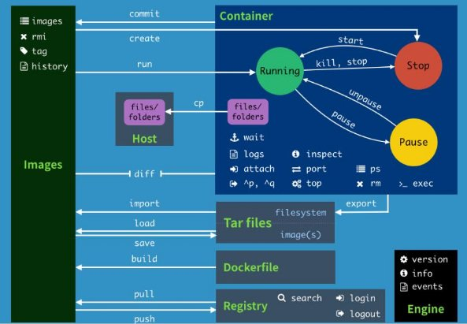
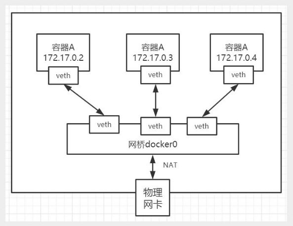
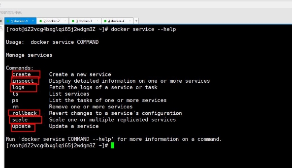

**狂神说Docker**

 版权声明：关于狂神说Java

不为任何机构站台，编程是爱好，恭喜你发现宝藏男孩一枚 所有的课程都是免费的，任何利用我课程收费的都是骗子，请大家注意！ B站唯一账号：狂神说Java            唯一公众号：狂神说 学习前，三连关注分享支持，是最基本的尊重，拒绝白嫖！

~希望你们关注我是因为喜欢我！

给大家聊聊三体的一句话，很有感触：弱小和无知不是生存的障碍，傲慢才是。

**Docker概述**

**Docker为什么出现**

一款产品从开发到上线，从操作系统，到运行环境，再到应用配置。作为开发+运维之间的协作我们需要 关心很多东西，这也是很多互联网公司都不得不面对的问题，特别是各种版本的迭代之后，不同版本环 境的兼容，对运维人员是极大的考验！

环境配置如此麻烦，换一台机器，就要重来一次，费力费时。很多人想到，能不能从根本上解决问题， 软件可以带环境安装？也就是说，安装的时候，把原始环境一模一样地复制过来。解决开发人员说的“ 在 我的机器上可正常工作”的问题。

之前在服务器配置一个应用的运行环境，要安装各种软件，就拿一个基本的工程项目的环境来说吧， Java/Tomcat/MySQL/JDBC驱动包等。安装和配置这些东西有多麻烦就不说了，它还不能跨平台。假如 我们是在 Windows 上安装的这些环境，到了 Linux 又得重新装。况且就算不跨操作系统，换另一台同 样操作系统的服务器，要移植应用也是非常麻烦的。

传统上认为，软件编码开发/测试结束后，所产出的成果即是程序或是能够编译执行的二进制字节码文件 等（Java为例）。而为了让这些程序可以顺利执行，开发团队也得准备完整的部署文件，让维运团队得 以部署应用程式，**开发需要清楚的告诉运维部署团队，用的全部配置文件+所有软件环境。不过，即便如 此，仍然常常发生部署失败的状况。**

Docker之所以发展如此迅速，也是因为它对此给出了一个标准化的解决方案。

Docker镜像的设计，使得Docker得以打破过去「程序即应用」的观念。通过Docker镜像 ( images ) 将 应用程序所需要的系统环境，由下而上打包，达到应用程序跨平台间的无缝接轨运作。

Docker的思想来自于集装箱，集装箱解决了什么问题？在一艘大船上，可以把货物规整的摆放起来。并 且各种各样的货物被集装箱标准化了，集装箱和集装箱之间不会互相影响。那么我就不需要专门运送水 果的船和专门运送化学品的船了。只要这些货物在集装箱里封装的好好的，那我就可以用一艘大船把他 们都运走。

docker就是类似的理念。  历史

2010年，几个搞IT的年轻人，在美国旧金山成立了一家名叫“dotCloud”的公司。 这家公司主要提供基于PaaS的云计算技术服务。具体来说，是和LXC有关的容器技术。 后来，dotCloud公司将自己的容器技术进行了简化和标准化，并命名为——**Docker**。 Docker技术诞生之后，并没有引起行业的关注。而dotCloud公司，作为一家小型创业企业，在激烈的竞

争之下，也步履维艰。

正当他们快要坚持不下去的时候，脑子里蹦出了“开源”的想法。

什么是“开源”？开源，就是开放源代码。也就是将原来内部保密的程序源代码开放给所有人，然后让大 家一起参与进来，贡献代码和意见。

有的软件是一开始就开源的。也有的软件，是混不下去，创造者又不想放弃，所以选择开源。自己养不 活，就吃“百家饭”嘛。

2013年3月，dotCloud公司的创始人之一，Docker之父，28岁的**Solomon Hykes**正式决定，将 Docker项目开源。

不开则已，一开惊人。 越来越多的IT工程师发现了Docker的优点，然后蜂拥而至，加入Docker开源社区。 Docker的人气迅速攀升，速度之快，令人瞠目结舌。

开源当月，Docker 0.1 版本发布。此后的每一个月，Docker都会发布一个版本。到2014年6月9日， Docker 1.0 版本正式发布。

此时的Docker，已经成为行业里人气最火爆的开源技术，没有之一。甚至像Google、微软、Amazon、 VMware这样的巨头，都对它青睐有加，表示将全力支持。

Docker和容器技术为什么会这么火爆？说白了，就是因为它“轻”。 在容器技术之前，业界的网红是**虚拟机**。虚拟机技术的代表，是**VMWare**和**OpenStack**。

相信很多人都用过虚拟机。虚拟机，就是在你的操作系统里面，装一个软件，然后通过这个软件，再模 拟一台甚至多台“子电脑”出来。

在“子电脑”里，你可以和正常电脑一样运行程序，例如开QQ。如果你愿意，你可以变出好几个“子电 脑”，里面都开上QQ。“子电脑”和“子电脑”之间，是**相互隔离**的，互不影响。

虚拟机属于虚拟化技术。而Docker这样的容器技术，也是虚拟化技术，属于**轻量级的虚拟化**。 虚拟机虽然可以隔离出很多“子电脑”，但占用空间更大，启动更慢，虚拟机软件可能还要花钱（例如

VMWare）。

而容器技术恰好没有这些缺点。它不需要虚拟出整个操作系统，只需要虚拟一个小规模的环境（类似“沙 箱”）。

它启动时间很快，几秒钟就能完成。而且，它对资源的利用率很高（一台主机可以同时运行几千个 Docker容器）。此外，它占的空间很小，虚拟机一般要几GB到几十GB的空间，而容器只需要MB级甚至 KB级。

正因为如此，容器技术受到了热烈的欢迎和追捧，发展迅速。

 docker 理念 Docker是基于Go语言实现的云开源项目。

Docker的主要目标是“Build，Ship and Run Any App , Anywhere”，也就是通过对应用组件的封装、分 发、部署、运行等生命周期的管理，使用户的APP（可以是一个WEB应用或数据库应用等等）及其运行 环境能够做到“一次封装，到处运行”。

Linux 容器技术的出现就解决了这样一个问题，而 Docker 就是在它的基础上发展过来的。将应用运行在 Docker 容器上面，而 Docker 容器在任何操作系统上都是一致的，这就实现了跨平台、跨服务器。只需 要一次配置好环境，换到别的机子上就可以一键部署好，大大简化了操作。

**Docker能干嘛**

 之前的虚拟机技术

虚拟机（virtual machine）就是带环境安装的一种解决方案。

它可以在一种操作系统里面运行另一种操作系统，比如在Windows 系统里面运行Linux 系统。应用程序 对此毫无感知，因为虚拟机看上去跟真实系统一模一样，而对于底层系统来说，虚拟机就是一个普通文 件，不需要了就删掉，对其他部分毫无影响。这类虚拟机完美的运行了另一套系统，能够使应用程序， 操作系统和硬件三者之间的逻辑不变。

**虚拟机的缺点：** 1、资源占用多 2、冗余步骤多 3 、启动慢

 容器虚拟化技术

由于前面虚拟机存在这些缺点，Linux 发展出了另一种虚拟化技术：Linux 容器（Linux Containers，缩 写为 LXC）。

Linux 容器不是模拟一个完整的操作系统，而是对进程进行隔离。有了容器，就可以将软件运行所需的 所有资源打包到一个隔离的容器中。容器与虚拟机不同，不需要捆绑一整套操作系统，只需要软件工作 所需的库资源和设置。系统因此而变得高效轻量并保证部署在任何环境中的软件都能始终如一地运行。

比较了 Docker 和传统虚拟化方式的不同之处：

- 传统虚拟机技术是虚拟出一套硬件后，在其上运行一个完整操作系统，在该系统上再运行所需应用 进程；
  - 而容器内的应用进程直接运行于宿主的内核，容器内没有自己的内核，而且也没有进行硬件虚拟。 因此容器要比传统虚拟机更为轻便。
    - 每个容器之间互相隔离，每个容器有自己的文件系统 ，容器之间进程不会相互影响，能区分计算资 源。

 开发/运维（DevOps） **更快速的应用交付和部署：**

传统的应用开发完成后，需要提供一堆安装程序和配置说明文档，安装部署后需根据配置文档进行繁杂 的配置才能正常运行。Docker化之后只需要交付少量容器镜像文件，在正式生产环境加载镜像并运行即 可，应用安装配置在镜像里已经内置好，大大节省部署配置和测试验证时间。

**更便捷的升级和扩缩容：**

随着微服务架构和Docker的发展，大量的应用会通过微服务方式架构，应用的开发构建将变成搭乐高积 木一样，每个Docker容器将变成一块“积木”，应用的升级将变得非常容易。当现有的容器不足以支撑业 务处理时，可通过镜像运行新的容器进行快速扩容，使应用系统的扩容从原先的天级变成分钟级甚至秒 级。

**更简单的系统运维：**

应用容器化运行后，生产环境运行的应用可与开发、测试环境的应用高度一致，容器会将应用程序相关 的环境和状态完全封装起来，不会因为底层基础架构和操作系统的不一致性给应用带来影响，产生新的 BUG。当出现程序异常时，也可以通过测试环境的相同容器进行快速定位和修复。

**更高效的计算资源利用：**

Docker是内核级虚拟化，其不像传统的虚拟化技术一样需要额外的Hypervisor [管理程序] 支持，所以在 一台物理机上可以运行很多个容器实例，可大大提升物理服务器的CPU和内存的利用率。

 学习途径

Docker官网：[http://www.docker.com ](http://www.docker.com/)Docker中文网站：[https://www.docker-cn.com ](https://www.docker-cn.com/)Docker Hub官网：[https://hub.docker.com  （仓库） ](https://hub.docker.com/)还是我那句话，只要学不死，就往死里学！

我还是坚信，真正好的教学就是授人以渔，避免大家少走弯路，让所有人能有一个公平的学习环境。我 的所有课程都是免费的，大家千万不要上当受骗哦，ok，让我们学习来！

**Docker安装**

**Docker的基本组成**

**Docker的架构图**

**镜像（image）：**

1 Docker 镜像（Image）就是一个只读的模板。镜像可以用来创建 Docker 容器，一个镜像可以创建很 多容器。 就好似 Java 中的 类和对象，类就是镜像，容器就是对象！

**容器（container）：**

1 Docker 利用容器（Container）独立运行的一个或一组应用。容器是用镜像创建的运行实例。

2

3 它可以被启动、开始、停止、删除。每个容器都是相互隔离的，保证安全的平台。

4

5 可以把容器看做是一个简易版的 Linux 环境（包括root用户权限、进程空间、用户空间和网络空间等） 和运行在其中的应用程序。。

6

7 容器的定义和镜像几乎一模一样，也是一堆层的统一视角，唯一区别在于容器的最上面那一层是可读可写 的。

**仓库（repository）：**

1 仓库（Repository）是集中存放镜像文件的场所。

2

3 仓库(Repository)和仓库注册服务器（Registry）是有区别的。仓库注册服务器上往往存放着多个仓 库，每个仓库中又包含了多个镜像，每个镜像有不同的标签（tag）。

4

5 仓库分为公开仓库（Public）和私有仓库（Private）两种形式。

6

7  最大的公开仓库是 Docker Hub(https://hub.docker.com/)，存放了数量庞大的镜像供用户下载。
7  国内的公开仓库包括阿里云 、网易云 等

**小结：** 需要正确的理解仓储/镜像/容器这几个概念 :

- Docker 本身是一个容器运行载体或称之为管理引擎。我们把应用程序和配置依赖打包好形成一个 可交付的运行环境，这个打包好的运行环境就似乎 image镜像文件。只有通过这个镜像文件才能生 成 Docker 容器。image 文件可以看作是容器的模板。Docker 根据 image 文件生成容器的实例。 同一个 image 文件，可以生成多个同时运行的容器实例。
  - image 文件生成的容器实例，本身也是一个文件，称为镜像文件。
    - 一个容器运行一种服务，当我们需要的时候，就可以通过docker客户端创建一个对应的运行实例， 也就是我们的容器
      - 至于仓库，就是放了一堆镜像的地方，我们可以把镜像发布到仓库中，需要的时候从仓库中拉下来 就可以了。

**环境说明**

我们使用的是 CentOS 7 (64-bit) 

目前，CentOS 仅发行版本中的内核支持 Docker。

Docker 运行在 CentOS 7 上，要求系统为64位、系统内核版本为 3.10 以上。

**查看自己的内核：**

` `命令用于打印当前系统相关信息（内核版本号、硬件架构、主机名称和操作系统类型 等）。

1  [root@kuangshen ~]# uname -r
1  3.10.0-1062.12.1.el7.x86\_64

**查看版本信息：**

1  [root@kuangshen ~]# cat /etc/os-release
1  NAME="CentOS Linux"
1  VERSION="7 (Core)"
1  ID="centos"
1  ID\_LIKE="rhel fedora"
1  VERSION\_ID="7"
1  PRETTY\_NAME="CentOS Linux 7 (Core)"
1  ANSI\_COLOR="0;31"
1  CPE\_NAME="cpe:/o:centos:centos:7"
1  HOME\_URL="https://www.centos.org/"
1  BUG\_REPORT\_URL="https://bugs.centos.org/" 12
13  CENTOS\_MANTISBT\_PROJECT="CentOS-7"
13  CENTOS\_MANTISBT\_PROJECT\_VERSION="7"
13  REDHAT\_SUPPORT\_PRODUCT="centos"
13  REDHAT\_SUPPORT\_PRODUCT\_VERSION="7"

**安装步骤**

1、官网安装参考手册：[https://docs.docker.com/engine/install/centos/ ](https://docs.docker.com/engine/install/centos/)2、确定你是CentOS7及以上版本，我们已经做过了 3、yum安装gcc相关环境（需要确保 虚拟机可以上外网 ）

1  yum -y install gcc
1  yum -y install gcc-c++

4、卸载旧版本

1  yum remove docker \
1  docker-client \
1  docker-client-latest \
1  docker-common \
1  docker-latest \
1  docker-latest-logrotate \
1  docker-logrotate \
1  docker-engine

5、安装需要的软件包

1 yum install -y yum-utils

6、设置镜像仓库

1  # 错误
1  yum-config-manager --add-repo https://download.docker.com/linux/centos/docker-ce.repo
1  ## 报错
1  [Errno 14] curl#35 - TCP connection reset by peer
1  [Errno 12] curl#35 - Timeout

6

7  # 正确推荐使用国内的
7  yum-config-manager --add-repo http://mirrors.aliyun.com/docker- ce/linux/centos/docker-ce.repo

7、更新yum软件包索引

1 yum makecache fast

8、安装 Docker CE

1 yum install docker-ce docker-ce-cli containerd.io

9、启动 Docker

1 systemctl start docker

10、测试命令

1 docker version 2 3 docker run hello-world 4 5 docker images

11、卸载

1 systemctl stop docker 2

3 yum -y remove docker-ce docker-ce-cli containerd.io 4

5 rm -rf /var/lib/docker

**阿里云镜像加速**

1、介绍：[https://www.aliyun.com/product/acr ](https://www.aliyun.com/product/acr)2、注册一个属于自己的阿里云账户(可复用淘宝账号) 3、进入管理控制台设置密码，开通 4、查看镜像加速器自己的

5、配置镜像加速

1 sudo mkdir -p /etc/docker 2

3  sudo tee /etc/docker/daemon.json <<-'EOF'
3  {
3  "registry-mirrors": ["https://qiyb9988.mirror.aliyuncs.com"]
3  }
3  EOF

8 9 sudo systemctl daemon-reload

10 11 sudo systemctl restart docker

测试 HelloWorld 1、启动hello-world

1 docker run hello-world

2、run干了什么？

**底层原理**

**Docker是怎么工作的**

Docker是一个Client-Server结构的系统，Docker守护进程运行在主机上， 然后通过Socket连接从客户 端访问，守护进程从客户端接受命令并管理运行在主机上的容器。 容器，是一个运行时环境，就是我们 前面说到的集装箱。

**为什么Docker比较 VM 快**

1、docker有着比虚拟机更少的抽象层。由亍docker不需要Hypervisor实现硬件资源虚拟化,运行在 docker容器上的程序直接使用的都是实际物理机的硬件资源。因此在CPU、内存利用率上docker将会在 效率上有明显优势。

2、docker利用的是宿主机的内核,而不需要Guest OS。因此,当新建一个容器时,docker不需要和虚拟机 一样重新加载一个操作系统内核。仍而避免引寻、加载操作系统内核返个比较费时费资源的过程,当新建 一个虚拟机时,虚拟机软件需要加载Guest OS,返个新建过程是分钟级别的。而docker由于直接利用宿主 机的操作系统,则省略了返个过程,因此新建一个docker容器只需要几秒钟。

**Docker常用命令**

**帮助命令**

1  docker version  # 显示 Docker 版本信息。
1  docker info    # 显示 Docker 系统信息，包括镜像和容器数。。
1  docker --help   # 帮助

**镜像命令**

**docker images**

1  # 列出本地主机上的镜像 
1  [root@kuangshen ~]# docker images
1  REPOSITORY      TAG         IMAGE ID       CREATED       SIZE
1  hello-world     latest        bf756fb1ae65     4 months ago     13.3kB

5

6  # 解释
6  REPOSITORY  镜像的仓库源
6  TAG      镜像的标签
6  IMAGE ID   镜像的ID
6  CREATED    镜像创建时间
6  SIZE     镜像大小

12

13 # 同一个仓库源可以有多个 TAG，代表这个仓库源的不同版本，我们使用REPOSITORY：TAG 定义不同 的镜像，如果你不定义镜像的标签版本，docker将默认使用 lastest 镜像！

14

15  # 可选项
15  -a：     列出本地所有镜像
15  -q：     只显示镜像id
15  --digests： 显示镜像的摘要信息

**docker search**

1  # 搜索镜像
1  [root@kuangshen ~]# docker search mysql
1  NAME    DESCRIPTION                   STARS       

` `OFFICIAL     

4  mysql    MySQL is a widely used, open-source relation…  9484         [OK]        

5

6 # docker search 某个镜像的名称  对应DockerHub仓库中的镜像 7

8  # 可选项
8  --filter=stars=50  ： 列出收藏数不小于指定值的镜像。

**docker pull**

1  # 下载镜像
1  [root@kuangshen ~]# docker pull mysql
1  Using default tag: latest # 不写tag，默认是latest
1  latest: Pulling from library/mysql
1  54fec2fa59d0: Already exists  # 分层下载
1  bcc6c6145912: Already exists 
1  951c3d959c9d: Already exists 
1  05de4d0e206e: Already exists 
1  319f0394ef42: Already exists 
1  d9185034607b: Already exists 
1  013a9c64dadc: Already exists 
1  42f3f7d10903: Pull complete 
1  c4a3851d9207: Pull complete 
14  82a1cc65c182: Pull complete 
14  a0a6b01efa55: Pull complete 
14  bca5ce71f9ea: Pull complete 
14  Digest: sha256:61a2a33f4b8b4bc93b7b6b9e65e64044aaec594809f818aeffbff69a893d1944  # 签名
14  Status: Downloaded newer image for mysql:latest
14  docker.io/library/mysql:latest  # 真实位置

20

21  # 指定版本下载
21  [root@kuangshen ~]# docker pull mysql:5.7
21  ....

**docker rmi**

1  # 删除镜像
1  docker rmi -f 镜像id             # 删除单个
1  docker rmi -f 镜像名:tag 镜像名:tag      # 删除多个
1  docker rmi -f $(docker images -qa)      # 删除全部

**容器命令**

说明：有镜像才能创建容器，我们这里使用 centos 的镜像来测试，就是虚拟一个 centos ！

1 docker pull centos

**新建容器并启动**

1  # 命令
1  docker run [OPTIONS] IMAGE [COMMAND][ARG...] 3

   4  # 常用参数说明
   4  --name="Name"        # 给容器指定一个名字
   4  -d              # 后台方式运行容器，并返回容器的id！
   4  -i              # 以交互模式运行容器，通过和 -t 一起使用
   4  -t              # 给容器重新分配一个终端，通常和 -i 一起使用
   4  -P              # 随机端口映射（大写）
10  -p              # 指定端口映射（小结），一般可以有四种写法
10  ip:hostPort:containerPort
10  ip::containerPort
10  hostPort:containerPort (常用)
10  containerPort

15

16  # 测试
16  [root@kuangshen ~]# docker images
16  REPOSITORY      TAG         IMAGE ID       CREATED       SIZE
16  centos        latest        470671670cac     3 months ago     237MB

20

21  # 使用centos进行用交互模式启动容器，在容器内执行/bin/bash命令！
21  [root@kuangshen ~]# docker run -it centos /bin/bash
21  [root@dc8f24dd06d0 /]# ls   # 注意地址，已经切换到容器内部了！
21  bin  etc  lib    lost+found  mnt  proc  run  srv  tmp  var
21  dev  home  lib64  media    opt  root  sbin  sys  usr
26  [root@dc8f24dd06d0 /]# exit  # 使用 exit 退出容器
26  exit
26  [root@kuangshen ~]# 

**列出所有运行的容器**

1  # 命令
1  docker ps [OPTIONS]

3

4  # 常用参数说明
4  -a    # 列出当前所有正在运行的容器 + 历史运行过的容器
4  -l    # 显示最近创建的容器
4  -n=?   # 显示最近n个创建的容器
4  -q    # 静默模式，只显示容器编号。

**退出容器**

1  exit     # 容器停止退出
1  ctrl+P+Q   # 容器不停止退出

**启动停止容器**

1  docker start (容器id or 容器名)     # 启动容器
1  docker restart (容器id or 容器名)    # 重启容器
1  docker stop (容器id or 容器名)     # 停止容器
1  docker kill (容器id or 容器名)     # 强制停止容器

**删除容器**

1  docker rm 容器id          # 删除指定容器
1  docker rm -f $(docker ps -a -q)  # 删除所有容器
1  docker ps -a -q|xargs docker rm  # 删除所有容器

**常用其他命令**

**后台启动容器**

1  # 命令
1  docker run -d 容器名

3

4  # 例子
4  docker run -d centos # 启动centos，使用后台方式启动

6

7  # 问题： 使用docker ps 查看，发现容器已经退出了！
7  # 解释：Docker容器后台运行，就必须有一个前台进程，容器运行的命令如果不是那些一直挂起的命 令，就会自动退出。
7  # 比如，你运行了nginx服务，但是docker前台没有运行应用，这种情况下，容器启动后，会立即自 杀，因为他觉得没有程序了，所以最好的情况是，将你的应用使用前台进程的方式运行启动。

**查看日志**

1  # 命令
1  docker logs -f -t --tail 容器id

3

4  # 例子：我们启动 centos，并编写一段脚本来测试玩玩！最后查看日志
5  [root@kuangshen ~]# docker run -d centos /bin/sh -c "while true;do echo kuangshen;sleep 1;done"

6

7  [root@kuangshen ~]# docker ps
7  CONTAINER ID     IMAGE 
7  c8530dbbe3b4     centos

10

11  # -t 显示时间戳 
11  # -f 打印最新的日志 
11  # --tail 数字  显示多少条！
11  [root@kuangshen ~]# docker logs -tf --tail 10 c8530dbbe3b4
11  2020-05-11T08:46:40.656901941Z kuangshen
11  2020-05-11T08:46:41.658765018Z kuangshen
11  2020-05-11T08:46:42.661015375Z kuangshen
11  2020-05-11T08:46:43.662865628Z kuangshen
11  2020-05-11T08:46:44.664571547Z kuangshen
11  2020-05-11T08:46:45.666718583Z kuangshen
11  2020-05-11T08:46:46.668556725Z kuangshen
11  2020-05-11T08:46:47.670424699Z kuangshen
11  2020-05-11T08:46:48.672324512Z kuangshen
11  2020-05-11T08:46:49.674092766Z kuangshen

**查看容器中运行的进程信息，支持 ps 命令参数。**

1  # 命令
1  docker top 容器id

3

4  # 测试
4  [root@kuangshen ~]# docker top c8530dbbe3b4
4  UID   PID   PPID   C   STIME   TTY  TIME     CMD
4  root   27437  27421  0   16:43   ?    00:00:00   /bin/sh -c ....

**查看容器/镜像的元数据**

1  # 命令
1  docker inspect 容器id

3

4  # 测试
4  [root@kuangshen ~]# docker inspect c8530dbbe3b4
4  [
4  {
4  # 完整的id，有意思啊，这里上面的容器id，就是截取的这个id前几位！
4  "Id": "c8530dbbe3b44a0c873f2566442df6543ed653c1319753e34b400efa05f77cf8",
10  "Created": "2020-05-11T08:43:45.096892382Z",
10  "Path": "/bin/sh",
10  "Args": [ 
10  "-c",
10  "while true;do echo kuangshen;sleep 1;done"
10  ],
10  # 状态
10  "State": { 
10  "Status": "running",
10  "Running": true,
10  "Paused": false,
10  "Restarting": false,
10  "OOMKilled": false,
10  "Dead": false,

|24 25 26 27 28 29 30 31|
`       `"Pid": 27437,

`       `"ExitCode": 0,

`       `"Error": "",

`       `"StartedAt": "2020-05-11T08:43:45.324474622Z",        "FinishedAt": "0001-01-01T00:00:00Z"

`     `},

`   `// ...........

]
|
| - | - |
|**进入正**|**在运行的容器**|
|
1 2 3 4 5

6 7

8 9 10 11

12 13

14 15 16 17 18 19 20 21 22

23

24 25

26 27 28 29 30
|
- 命令1

docker exec -it 容器id bashShell

- 测试1

[root@kuangshen ~]# docker ps

CONTAINER ID     IMAGE        COMMAND          CREATED   

`    `STATUS        PORTS        NAMES

c8530dbbe3b4     centos        "/bin/sh -c 'while t…"  12 minutes ago    Up 12 minutes              happy\_chaum [root@kuangshen ~]# docker exec -it c8530dbbe3b4 /bin/bash [root@c8530dbbe3b4 /]# ps -ef

UID     PID  PPID  C STIME TTY      TIME CMD

root     1   0  0 08:43 ?     00:00:00 /bin/sh -c while true;do echo kuangshen;sleep

root    751   0  0 08:56 pts/0   00:00:00 /bin/bash

root    769   1  0 08:56 ?     00:00:00 /usr/bin/coreutils -- coreutils-prog-shebang=s

root    770  751  0 08:56 pts/0   00:00:00 ps -ef

- 命令2

docker attach 容器id

- 测试2

[root@kuangshen ~]# docker exec -it c8530dbbe3b4 /bin/bash [root@c8530dbbe3b4 /]# ps -ef

UID     PID  PPID  C STIME TTY      TIME CMD

root     1   0  0 08:43 ?     00:00:00 /bin/sh -c while true;do echo kuangshen;sleep

root    856   0  0 08:57 pts/0   00:00:00 /bin/bash

root    874   1  0 08:57 ?     00:00:00 /usr/bin/coreutils -- coreutils-prog-shebang=s

root    875  856  0 08:57 pts/0   00:00:00 ps -ef

- 区别

- exec  是在容器中打开新的终端，并且可以启动新的进程

- attach 直接进入容器启动命令的终端，不会启动新的进程
|
|**从容器**|**内拷贝文件到主机上**|
|1 2 3 4 5 6 7 8|
- 命令

docker cp 容器id:容器内路径 目的主机路径

- 测试

- 容器内执行，创建一个文件测试 [root@c8530dbbe3b4 /]# cd /home [root@c8530dbbe3b4 home]# touch f1 [root@c8530dbbe3b4 home]# ls
|
|||
9  f1
9  [root@c8530dbbe3b4 home]# exit 
9  exit

12

13  # linux复制查看，是否复制成功
13  [root@kuangshen ~]# docker cp c8530dbbe3b4:/home/f1 /home
13  [root@kuangshen ~]# cd /home
13  [root@kuangshen home]# ls
13  f1

**小结**

常用命令

1  attach   Attach to a running container         # 当前 shell 下 

attach 连接指定运行镜像

2  build   Build an image from a Dockerfile        # 通过 Dockerfile 定 制镜像
2  commit   Create a new image from a container changes  # 提交当前容器为新的镜像
2  cp     Copy files/folders from the containers filesystem to the host path  #从容器中拷贝指定文件或者目录到宿主机中
2  create   Create a new container             # 创建一个新的容器，同 run，但不启动容器
2  diff    Inspect changes on a container's filesystem  # 查看 docker 容器变化
2  events   Get real time events from the server      # 从 docker 服务获取容 器实时事件
2  exec    Run a command in an existing container     # 在已存在的容器上运行命 令
2  export   Stream the contents of a container as a tar archive  # 导出容器的内 容流作为一个 tar 归档文件[对应 import ]
2  history  Show the history of an image          # 展示一个镜像形成历史
2  images   List images                  # 列出系统当前镜像
12  import   Create a new filesystem image from the contents of a tarball # 从 tar包中的内容创建一个新的文件系统映像[对应export]
12  info    Display system-wide information        # 显示系统相关信息
12  inspect  Return low-level information on a container  # 查看容器详细信息
12  kill    Kill a running container            # kill 指定 docker 容

器

16  load    Load an image from a tar archive        # 从一个 tar 包中加载一 个镜像[对应 save]
16  login   Register or Login to the docker registry server   # 注册或者登陆一个 docker 源服务器
16  logout   Log out from a Docker registry server      # 从当前 Docker registry 退出
16  logs    Fetch the logs of a container         # 输出当前容器日志信息
16  port    Lookup the public-facing port which is NAT-ed to PRIVATE\_PORT   # 查看映射端口对应的容器内部源端口
16  pause   Pause all processes within a container     # 暂停容器
16  ps     List containers                # 列出容器列表
16  pull    Pull an image or a repository from the docker registry server  # 从docker镜像源服务器拉取指定镜像或者库镜像
16  push    Push an image or a repository to the docker registry server   # 推送指定镜像或者库镜像至docker源服务器
16  restart  Restart a running container          # 重启运行的容器
16  rm     Remove one or more containers         # 移除一个或者多个容器
16  rmi    Remove one or more images       # 移除一个或多个镜像[无容器使用该 镜像才可删除，否则需删除相关容器才可继续或 -f 强制删除]
16  run    Run a command in a new container        # 创建一个新的容器并运行 一个命令
16  save    Save an image to a tar archive         # 保存一个镜像为一个 

tar 包[对应 load]

30  search   Search for an image on the Docker Hub     # 在 docker hub 中搜 索镜像
30  start   Start a stopped containers           # 启动容器
30  stop    Stop a running containers           # 停止容器
30  tag    Tag an image into a repository         # 给源中镜像打标签
30  top    Lookup the running processes of a container  # 查看容器中运行的进程信

息

35  unpause  Unpause a paused container           # 取消暂停容器
35  version  Show the docker version information      # 查看 docker 版本号
35  wait    Block until a container stops, then print its exit code  # 截取容 器停止时的退出状态值

**作业练习**

 使用Docker 安装 Nginx

1  # 1、搜索镜像
1  [root@kuangshen ~]# docker search nginx
1  NAME    DESCRIPTION          STARS        OFFICIAL  
1  nginx   Official build of Nginx.    13159        [OK]       

5

6  # 2、拉取镜像
6  [root@kuangshen ~]# docker pull nginx
6  Using default tag: latest

|
9 10 11 12 13

14 15 16 17 18 19

20 21 22

23 24 25 26 27 28 29 30 31 32

33 34 35 36 37 38 39 40 41 42 43 44 45 46 47 48 49 50 51 52 53

54 55 56 57 58 59 60 61
|
latest: Pulling from library/nginx

54fec2fa59d0: Pull complete 

4ede6f09aefe: Pull complete 

f9dc69acb465: Pull complete 

Digest: sha256:86ae264c3f4acb99b2dee4d0098c40cb8c46dcf9e1148f05d3a51c4df6758c12 Status: Downloaded newer image for nginx:latest docker.io/library/nginx:latest

- 3、启动容器

[root@kuangshen ~]# docker images

REPOSITORY      TAG         IMAGE ID       CREATED     

`  `SIZE

diytomcat      latest        ffdf6529937d     3 hours ago   

`  `636MB

nginx        latest        602e111c06b6     2 weeks ago   

`  `127MB

centos        latest        470671670cac     3 months ago   

`  `237MB

[root@kuangshen ~]# docker run -d --name mynginx -p 3500:80 nginx a95d5f2f057fc609082cfa0de906bd690f95c43a26d38420d081f0e255b232ec [root@kuangshen ~]# docker ps

CONTAINER ID     IMAGE    PORTS          NAMES

a95d5f2f057f     nginx    0.0.0.0:3500->80/tcp  mynginx

- 4、测试访问

[root@kuangshen ~]# curl localhost:3500 <html>

`   `<title>Welcome to nginx!</title>  # ok    ....

</html>

- 5、进入容器

[root@kuangshen ~]# docker exec -it mynginx /bin/bash root@a95d5f2f057f:/# whereis nginx  # 寻找nginx

nginx: /usr/sbin/nginx /usr/lib/nginx /etc/nginx /usr/share/nginx root@a95d5f2f057f:/# cd /usr/share/nginx  # nginx 的路径 root@a95d5f2f057f:/usr/share/nginx# ls

html

root@a95d5f2f057f:/usr/share/nginx# cd html  # 首页的位置 root@a95d5f2f057f:/usr/share/nginx/html# ls 

50x.html  index.html

root@a95d5f2f057f:/usr/share/nginx/html# cat index.html <!DOCTYPE html>

<html>

<head>

<title>Welcome to nginx!</title>

</head>

<body>

<h1>Welcome to nginx!</h1>

</html>
|
| - | - |
|||
 使用docker安装 tomcat

1  # 官方文档解释
1  # -it ：交互模式
1  # --rm：容器启动成功并退出以后容器就自动移除，一般在测试情况下使用！
1  docker run -it --rm tomcat:9.0

5

6  # 1、下载tomcat镜像
6  docker pull tomcat

8

9  # 2、启动
9  docker run -d -p 8080:8080 --name tomcat9 tomcat

11

12  # 3、进入tomcat
12  docker exec -it tomcat9 /bin/bash

14

15 # 4、思考：我们以后要部署项目，还需要进入容器中，是不是十分麻烦，要是有一种技术，可以将容器 内和我们Linux进行映射挂载就好了？我们后面会将数据卷技术来进行挂载操作，也是一个核心内容，这 里大家先听听名词就好，我们很快就会讲到！

使用docker 部署 es + kibana

1  # 我们启动es这种容器需要考虑几个问题
1  1、端口暴露问题 9200、9300
1  2、数据卷的挂载问题 data、plugins、conf
1  3、吃内存  - "ES\_JAVA\_OPTS=-Xms512m -Xmx512m"

5

6  # 扩展命令
6  docker stats 容器id   # 查看容器的cpu内存和网络状态

8

9  # 1、启动es测试
9  docker run -d --name elasticsearch -p 9200:9200 -p 9300:9300 -e "discovery.type=single-node" elasticsearch:7.6.2

11

12  # 2、启动之后很卡，使用 docker stats 容器id 查看下cpu状态 ，发现占用的很大
12  CONTAINER ID     NAME         CPU %        MEM USAGE / LIMIT   MEM %     
12  249ae46da625     elasticsearch    0.00%        1.036GiB / 1.716GiB  60.37%  

15

16  # 3、测试访问
16  [root@kuangshen data]# curl localhost:9200
16  {
16  "name" : "249ae46da625",
16  "cluster\_name" : "docker-cluster",
16  "cluster\_uuid" : "\_Ho\_i4fOTUesNc\_II35sSA",
16  "version" : {
16  "number" : "7.6.2",
16  "build\_flavor" : "default",
16  "build\_type" : "docker",
16  "build\_hash" : "ef48eb35cf30adf4db14086e8aabd07ef6fb113f",
16  "build\_date" : "2020-03-26T06:34:37.794943Z",
28  "build\_snapshot" : false,
28  "lucene\_version" : "8.4.0",
28  "minimum\_wire\_compatibility\_version" : "6.8.0",
28  "minimum\_index\_compatibility\_version" : "6.0.0-beta1"
28  },
28  "tagline" : "You Know, for Search"
28  }

35

36  # 4、增加上内存限制启动
36  docker run -d --name elasticsearch -p 9200:9200 -p 9300:9300 -e "discovery.type=single-node" -e ES\_JAVA\_OPTS="-Xms64m -Xmx512m" elasticsearch:7.6.2

38

39  # 5、启动之后，使用 docker stats  查看下cpu状态 
39  CONTAINER ID     NAME         CPU %        MEM USAGE / LIMIT   MEM %  
39  d2860684e7e4     elasticsearch    0.24%        358.3MiB / 1.716GiB  20.40% 

42

43  # 6、测试访问，效果一样，ok！
43  [root@kuangshen data]# curl localhost:9200

45 46 # 思考：如果我们要使用 kibana , 如果配置连接上我们的es呢？网络该如何配置呢？

**可视化**

 Portainer（先用这个）

1  docker run -d -p 8088:9000 \
1  --restart=always -v /var/run/docker.sock:/var/run/docker.sock -- privileged=true portainer/portainer

 Rancher（CI/CD再用这个）

1  #安装rancher-server
1  docker run --name rancher-server -p 8000:8080 -v /etc/localtime:/etc/localtime:ro  -d  rancher/server
1  #安装agent
1  docker run --rm --privileged -v /var/run/docker.sock:/var/run/docker.sock -v /var/lib/rancher:/var/lib/rancher rancher/agent:v1.2.11 http://39.101.191.131:8000/v1/scripts/D3DBD43F263109BB881F:1577750400000:7M0y BzCw4XSxJklD7TpysYIpI

**介绍：**

Portainer是Docker的图形化管理工具，提供状态显示面板、应用模板快速部署、容器镜像网络数据卷 的基本操作（包括上传下载镜像，创建容器等操作）、事件日志显示、容器控制台操作、Swarm集群和 服务等集中管理和操作、登录用户管理和控制等功能。功能十分全面，基本能满足中小型单位对容器管 理的全部需求。

如果仅有一个docker宿主机，则可使用单机版运行，Portainer单机版运行十分简单，只需要一条语句即 可启动容器，来管理该机器上的docker镜像、容器等数据。

1  docker run -d -p 8088:9000 \
1  --restart=always -v /var/run/docker.sock:/var/run/docker.sock -- privileged=true portainer/portainer

访问方式：[http://IP:8088 ](http://ip:8088/)首次登陆需要注册用户，给admin用户设置密码：

单机版这里选择local即可，选择完毕，点击Connect即可连接到本地docker：

登录成功！

我们可以点击可视化界面来玩玩！

**Docker镜像讲解**

**镜像是什么**

镜像是一种轻量级、可执行的独立软件包，用来打包软件运行环境和基于运行环境开发的软件，它包含 运行某个软件所需的所有内容，包括代码、运行时、库、环境变量和配置文件。

**Docker镜像加载原理**

 UnionFS （联合文件系统）

UnionFS（联合文件系统）：Union文件系统（UnionFS）是一种分层、轻量级并且高性能的文件系统， 它支持对文件系统的修改作为一次提交来一层层的叠加，同时可以将不同目录挂载到同一个虚拟文件系 统下(unite several directories into a single virtual filesystem)。Union 文件系统是 Docker 镜像的基 础。镜像可以通过分层来进行继承，基于基础镜像（没有父镜像），可以制作各种具体的应用镜像。

特性：一次同时加载多个文件系统，但从外面看起来，只能看到一个文件系统，联合加载会把各层文件 系统叠加起来，这样最终的文件系统会包含所有底层的文件和目录

 Docker镜像加载原理 docker的镜像实际上由一层一层的文件系统组成，这种层级的文件系统UnionFS。

bootfs(boot file system)主要包含bootloader和kernel, bootloader主要是引导加载kernel, Linux刚启 动时会加载bootfs文件系统，在Docker镜像的最底层是bootfs。这一层与我们典型的Linux/Unix系统是 一样的，包含boot加载器和内核。当boot加载完成之后整个内核就都在内存中了，此时内存的使用权已 由bootfs转交给内核，此时系统也会卸载bootfs。

rootfs (root file system) ，在bootfs之上。包含的就是典型 Linux 系统中的 /dev, /proc, /bin, /etc 等标 准目录和文件。rootfs就是各种不同的操作系统发行版，比如Ubuntu，Centos等等。

平时我们安装进虚拟机的CentOS都是好几个G，为什么Docker这里才200M？

对于一个精简的OS，rootfs 可以很小，只需要包含最基本的命令，工具和程序库就可以了，因为底层直 接用Host的kernel，自己只需要提供rootfs就可以了。由此可见对于不同的linux发行版, bootfs基本是一 致的, rootfs会有差别, 因此不同的发行版可以公用bootfs。

**分层理解**

 分层的镜像 我们可以去下载一个镜像，注意观察下载的日志输出，可以看到是一层一层的在下载！

思考：为什么Docker镜像要采用这种分层的结构呢？

最大的好处，我觉得莫过于是资源共享了！比如有多个镜像都从相同的Base镜像构建而来，那么宿主机 只需在磁盘上保留一份base镜像，同时内存中也只需要加载一份base镜像，这样就可以为所有的容器服 务了，而且镜像的每一层都可以被共享。

查看镜像分层的方式可以通过 docker image inspect 命令！

1  [root@kuangshen home]# docker image inspect redis:latest
1  [
1  // .....
1  "RootFS": {
1  "Type": "layers",
1  "Layers": [

7

"sha256:c2adabaecedbda0af72b153c6499a0555f3a769d52370469d8f6bd6328af9b13", 8

"sha256:744315296a49be711c312dfa1b3a80516116f78c437367ff0bc678da1123e990", 9

"sha256:379ef5d5cb402a5538413d7285b21aa58a560882d15f1f553f7868dc4b66afa8", 10

"sha256:d00fd460effb7b066760f97447c071492d471c5176d05b8af1751806a1f905f8", 11

"sha256:4d0c196331523cfed7bf5bafd616ecb3855256838d850b6f3d5fba911f6c4123", 12

"sha256:98b4a6242af2536383425ba2d6de033a510e049d9ca07ff501b95052da76e894"

13  ]
13  },
13  "Metadata": {
13  "LastTagTime": "0001-01-01T00:00:00Z"
13  }
13  }
13  ]

20

**理解：**

所有的 Docker 镜像都起始于一个基础镜像层，当进行修改或增加新的内容时，就会在当前镜像层之 上，创建新的镜像层。

举一个简单的例子，假如基于 Ubuntu Linux 16.04 创建一个新的镜像，这就是新镜像的第一层；如果 在该镜像中添加 Python包，就会在基础镜像层之上创建第二个镜像层；如果继续添加一个安全补丁，就 会创建第三个镜像层。

该镜像当前已经包含 3 个镜像层，如下图所示（这只是一个用于演示的很简单的例子）。

在添加额外的镜像层的同时，镜像始终保持是当前所有镜像的组合，理解这一点非常重要。下图中举了 一个简单的例子，每个镜像层包含 3 个文件，而镜像包含了来自两个镜像层的 6 个文件。

上图中的镜像层跟之前图中的略有区别，主要目的是便于展示文件。

下图中展示了一个稍微复杂的三层镜像，在外部看来整个镜像只有 6 个文件，这是因为最上层中的文件 7 是文件 5 的一个更新版本。

这种情况下，上层镜像层中的文件覆盖了底层镜像层中的文件。这样就使得文件的更新版本作为一个新 镜像层添加到镜像当中。

Docker 通过存储引擎（新版本采用快照机制）的方式来实现镜像层堆栈，并保证多镜像层对外展示为统 一的文件系统。

Linux 上可用的存储引擎有 AUFS、Overlay2、Device Mapper、Btrfs 以及 ZFS。顾名思义，每种存储 引擎都基于 Linux 中对应的文件系统或者块设备技术，并且每种存储引擎都有其独有的性能特点。

Docker 在 Windows 上仅支持 windowsfilter 一种存储引擎，该引擎基于 NTFS 文件系统之上实现了分 层和 CoW[1]。

下图展示了与系统显示相同的三层镜像。所有镜像层堆叠并合并，对外提供统一的视图。

 特点

Docker镜像都是只读的，当容器启动时，一个新的可写层被加载到镜像的顶部！ 这一层就是我们通常说的容器层，容器之下的都叫镜像层！

**镜像Commit**

**docker commit 从容器创建一个新的镜像。**

1 docker commit 提交容器副本使之成为一个新的镜像！

2

3  # 语法
3  docker commit -m="提交的描述信息" -a="作者" 容器id 要创建的目标镜像名:[标签名]

**测试**

1  # 1、从Docker Hub 下载tomcat镜像到本地并运行  -it 交互终端 -p 端口映射
1  docker run -it -p 8080:8080 tomcat

3

4  # 注意：坑爹：docker启动官方tomcat镜像的容器，发现404是因为使用了加速器，而加速器里的 tomcat的webapps下没有root等文件！
4  # 下载tomcat官方镜像，就是这个镜像（阿里云里的tomcat的webapps下没有任何文件）
4  # 进入tomcat查看cd到webapps下发现全部空的，反而有个webapps.dist里有对应文件，cp -r 到webapps下！
4  root@aba865b53114:/usr/local/tomcat# cp -r webapps.dist/\* webapps

8

9  # 2、删除上一步镜像产生的tomcat容器的文档
9  docker ps     # 查看容器id
9  docker exec -it 容器id /bin/bash
9  /usr/local/tomcat # ce webapps/
9  /usr/local/tomcat/webapps # ls -l  # 查看是否存在 docs文件夹
9  /usr/local/tomcat/webapps # curl localhost:8080/docs/  # 可以看到 docs 返回的 内容
9  /usr/local/tomcat/webapps # rm -rf docs # 删除它
9  /usr/local/tomcat/webapps # curl localhost:8080/docs/  # 再次访问返回404

17

18 # 3、当前运行的tomcat实例就是一个没有docs的容器，我们使用它为模板commit一个没有docs的 tomcat新镜像， tomcat02

19 20 docker ps -l  # 查看容器的id 21

22  # 注意：commit的时候，容器的名字不能有大写，否则报错：invalid reference format
22  docker commit -a="kuangshen" -m="no tomcat docs" 1e98a2f815b0 tomcat02:1.1 24

25 sha256:cdccd4674f93ad34bf73d9db577a20f027a6d03fd1944dc0e628ee4bf17ec748 26

27  [root@kuangshen /]# docker images  # 查看，我们自己提交的镜像已经OK了！
27  REPOSITORY      TAG         IMAGE ID       CREATED        SIZE
27  tomcat02       1.1         cdccd4674f93     About a minute ago  649MB
27  redis        latest        f9b990972689     9 days ago      104MB
27  tomcat        latest        927899a31456     2 weeks ago      647MB
27  centos        latest        470671670cac     3 months ago     237MB

33

34  # 4、这个时候，我们的镜像都是可以使用的，大家可以启动原来的tomcat，和我们新的tomcat02来 测试看看！
34  [root@kuangshen ~]# docker run -it -p 8080:8080 tomcat02:1.1 36

37 # 如果你想要保存你当前的状态，可以通过commit，来提交镜像，方便使用，类似于 VM 中的快照！

**容器数据卷**

**什么是容器数据卷**

**docker的理念回顾：**

将应用和运行的环境打包形成容器运行，运行可以伴随着容器，但是我们对于数据的要求，是希望能够 持久化的！

就好比，你安装一个MySQL，结果你把容器删了，就相当于删库跑路了，这TM也太扯了吧！ 所以我们希望容器之间有可能可以共享数据，Docker容器产生的数据，如果不通过docker commit 生成

新的镜像，使得数据作为镜像的一部分保存下来，那么当容器删除后，数据自然也就没有了！这样是行 不通的！

为了能保存数据在Docker中我们就可以使用卷！让数据挂载到我们本地！这样数据就不会因为容器删除 而丢失了！

**作用：**

卷就是目录或者文件，存在一个或者多个容器中，由docker挂载到容器，但不属于联合文件系统，因此 能够绕过 Union File System ， 提供一些用于持续存储或共享数据的特性：

卷的设计目的就是数据的持久化，完全独立于容器的生存周期，因此Docker不会在容器删除时删除其挂 载的数据卷。

**特点：**

1、数据卷可在容器之间共享或重用数据

2、卷中的更改可以直接生效 3、数据卷中的更改不会包含在镜像的更新中 4、数据卷的生命周期一直持续到没有容器使用它为止 **所以：总结一句话： 就是容器的持久化，以及容器间的继承和数据共享！**

**使用数据卷**

 方式一：容器中直接使用命令来添加

挂载

1  # 命令
1  docker run -it -v 宿主机绝对路径目录:容器内目录 镜像名 3
4  # 测试
4  [root@kuangshen ~]# docker run -it -v /home/ceshi:/home centos /bin/bash

查看数据卷是否挂载成功 

测试容器和宿主机之间数据共享：可以发现，在容器中，创建的会在宿主机中看到！

测试容器停止退出后，主机修改数据是否会同步！

1. 停止容器
1. 在宿主机上修改文件，增加些内容
1. 启动刚才停止的容器
1. 然后查看对应的文件，发现数据依旧同步！ok

 使用 docker 安装 mysql 思考：mysql 数据持久化的问题！

1  # 1、搜索镜像
1  [root@kuangshen ~]# docker search mysql
1  NAME                DESCRIPTION                   STARS       
1  mysql               MySQL is a widely used, open-source relation…  9488  

5

6  # 2、拉取镜像
6  [root@kuangshen ~]# docker pull mysql:5.7
6  5.7: Pulling from library/mysql
6  54fec2fa59d0: Already exists 
6  bcc6c6145912: Pull complete 
6  951c3d959c9d: Pull complete 
6  05de4d0e206e: Pull complete 
6  319f0394ef42: Pull complete 
6  d9185034607b: Pull complete 
6  013a9c64dadc: Pull complete 
6  e745b3361626: Pull complete 
6  03145d87b451: Pull complete 
6  3991a6b182ee: Pull complete 
6  62335de06f7d: Pull complete 
20  Digest: sha256:e821ca8cc7a44d354486f30c6a193ec6b70a4eed8c8362aeede4e9b8d74b8ebb
20  Status: Downloaded newer image for mysql:5.7
20  docker.io/library/mysql:5.7

23

24  # 3、启动容器  -e 环境变量！ 
24  # 注意： mysql的数据应该不丢失！先体验下 -v 挂载卷！ 参考官方文档
24  [root@kuangshen home]# docker run -d -p 3310:3306 -v /home/mysql/conf:/etc/mysql/conf.d -v /home/mysql/data:/var/lib/mysql -e MYSQL\_ROOT\_PASSWORD=123456 --name mysql01 mysql:5.7
24  4763fa5c68c4323688102f57938fb10996a0fb902d2812349286529f9378f16c

28 29 # 4、使用本地的sqlyog连接测试一下 3310 30

31  # 5、查看本地的 /home/mysql 目录
31  [root@kuangshen data]# pwd
31  /home/mysql/data
31  [root@kuangshen data]# ls
31  .. ... .  test  # 可以看到我们刚刚建立的mysql数据库在本地存储着

36

37  # 6、删除mysql容器
37  [root@kuangshen data]# docker rm -f mysql01  # 删除容器，然后发现远程连接失败！
37  mysql01
37  [root@kuangshen data]# ls
37  .. ... .  test    # 可以看到我们刚刚建立的mysql数据库在本地存储着

通过Docker File 来添加（了解）

DockerFile 是用来构建Docker镜像的构建文件，是由一些列命令和参数构成的脚本。 我们在这里，先体验下，后面我们会详细讲解 DockerFile ！

测试：

1  # 1、我们在宿主机 /home 目录下新建一个 docker-test-volume文件夹
1  [root@kuangshen home]# mkdir docker-test-volume

3

4  # 说明：在编写DockerFile文件中使用 VOLUME 指令来给镜像添加一个或多个数据卷
4  VOLUME["/dataVolumeContainer1","/dataVolumeContainer2","/dataVolumeContainer 3"]
4  # 出于可移植和分享的考虑，我们之前使用的 -v 主机目录:容器目录 这种方式不能够直接在 DockerFile中实现。
4  # 由于宿主机目录是依赖于特定宿主机的，并不能够保证在所有宿主机上都存在这样的特定目录.

8

9  # 2、编写DockerFile文件
9  [root@kuangshen docker-test-volume]# pwd
9  /home/docker-test-volume
9  [root@kuangshen docker-test-volume]# vim dockerfile1
9  [root@kuangshen docker-test-volume]# cat dockerfile1 
9  # volume test
9  FROM centos
9  VOLUME ["/dataVolumeContainer1","/dataVolumeContainer2"]
9  CMD echo "-------end------"
9  CMD /bin/bash

19

20  # 3、build后生成镜像，获得一个新镜像 kuangshen/centos
21  docker build -f /home/docker-test-volume/dockerfile1 -t kuangshen/centos . # 注意最后有个.

1  # 4、启动容器
1  [root@kuangshen docker-test-volume]# docker run -it 0e97e1891a3d /bin/bash # 启动容器

3

4  [root@f5824970eefc /]# ls -l
4  total 56
4  lrwxrwxrwx  1 root root   7 May 11  2019 bin -> usr/bin
4  drwxr-xr-x  2 root root 4096 May 11 11:55 dataVolumeContainer1  # 数据卷目录
4  drwxr-xr-x  2 root root 4096 May 11 11:55 dataVolumeContainer2  # 数据卷目录
4  drwxr-xr-x  5 root root  360 May 11 11:55 dev
10  drwxr-xr-x  1 root root 4096 May 11 11:55 etc
11  drwxr-xr-x  2 root root 4096 May 11  2019 home
11  .....

13

14 # 问题:通过上述步骤，容器内的卷目录地址就已经知道了，但是对应的主机目录地址在哪里呢？ 15

16  # 5、我们在数据卷中新建一个文件
16  [root@f5824970eefc dataVolumeContainer1]# pwd 
16  /dataVolumeContainer1
16  [root@f5824970eefc dataVolumeContainer1]# touch container.txt 
16  [root@f5824970eefc dataVolumeContainer1]# ls -l
16  total 0
16  -rw-r--r-- 1 root root 0 May 11 11:58 container.txt

23

24  # 6、查看下这个容器的信息
24  [root@kuangshen ~]# docker inspect 0e97e1891a3d
24  #  查看输出的Volumes
24  "Volumes": {
24  "/dataVolumeContainer1": {},
24  "/dataVolumeContainer2": {}
24  },

31 32 # 7、这个卷在主机对应的默认位置

注意：如果访问出现了 cannot open directory: Permission denied 解决办法：在挂载目录后多加一个 --privileged=true参数即可

**匿名和具名挂载**

1  # 匿名挂载
1  -v 容器内路径
1  docker run -d -P --name nginx01 -v /etc/nginx nginx

4

5  # 匿名挂载的缺点，就是不好维护，通常使用命令 docker volume维护
5  docker volume ls

7

8  # 具名挂载
8  -v 卷名:/容器内路径
8  docker run -d -P --name nginx02 -v nginxconfig:/etc/nginx nginx 11
12  # 查看挂载的路径
12  [root@kuangshen ~]# docker volume inspect nginxconfig
12  [
12  {
12  "CreatedAt": "2020-05-13T17:23:00+08:00",
12  "Driver": "local",
12  "Labels": null,
12  "Mountpoint": "/var/lib/docker/volumes/nginxconfig/\_data",
12  "Name": "nginxconfig",
12  "Options": null,
12  "Scope": "local"
12  }
12  ]

25

26  # 怎么判断挂载的是卷名而不是本机目录名？
26  不是/开始就是卷名，是/开始就是目录名

28

29  # 改变文件的读写权限
29  # ro: readonly
29  # rw: readwrite
29  # 指定容器对我们挂载出来的内容的读写权限
29  docker run -d -P --name nginx02 -v nginxconfig:/etc/nginx:ro nginx
29  docker run -d -P --name nginx02 -v nginxconfig:/etc/nginx:rw nginx

**数据卷容器**

命名的容器挂载数据卷，其他容器通过挂载这个（父容器）实现数据共享，挂载数据卷的容器，称之为 数据卷容器。

我们使用上一步的镜像：kuangshen/centos 为模板，运行容器 docker01，docker02，docker03，他 们都会具有容器卷

1  "/dataVolumeContainer1"
1  "/dataVolumeContainer2"

**我们来测试下，容器间传递共享**

1、先启动一个父容器docker01，然后在dataVolumeContainer2新增文件

退出不停止：ctrl+P+Q

2、创建docker02，docker03 让他们继承docker01   

1  [root@kuangshen docker-test-volume]# docker run -it --name docker02 -- volumes-from docker01 kuangshen/centos
1  [root@ea4c82779077 /]# cd /dataVolumeContainer2
1  [root@ea4c82779077 dataVolumeContainer2]# ls
1  docker01.txt
1  [root@95164598b306 dataVolumeContainer2]# touch docker02.txt
1  [root@95164598b306 dataVolumeContainer2]# ls
1  docker01.txt  docker02.txt

8

9  [root@kuangshen docker-test-volume]# docker run -it --name docker03 -- volumes-from docker01 kuangshen/centos
9  [root@ea4c82779077 /]# cd /dataVolumeContainer2
9  [root@ea4c82779077 dataVolumeContainer2]# ls
9  docker01.txt docker02.txt
9  [root@95164598b306 dataVolumeContainer2]# touch docker03.txt
9  [root@95164598b306 dataVolumeContainer2]# ls
9  docker01.txt docker02.txt docker03.txt

3、回到docker01发现可以看到 02 和 03 添加的共享文件

1  [root@kuangshen docker-test-volume]# docker attach docker01
1  [root@799b6ea5db7c dataVolumeContainer2]# ls -l
1  total 0
1  -rw-r--r-- 1 root root 0 May 11 13:20 docker01.txt
1  -rw-r--r-- 1 root root 0 May 11 13:22 docker02.txt
1  -rw-r--r-- 1 root root 0 May 11 13:24 docker03.txt

4、删除docker01，docker02 修改后docker03还能不能访问

1  [root@kuangshen docker-test-volume]# docker rm -f docker01
1  docker01
1  [root@kuangshen docker-test-volume]# docker attach docker02
1  [root@ea4c82779077 dataVolumeContainer2]# ls -l          
1  total 0
1  -rw-r--r-- 1 root root 0 May 11 13:20 docker01.txt
1  -rw-r--r-- 1 root root 0 May 11 13:22 docker02.txt
1  -rw-r--r-- 1 root root 0 May 11 13:24 docker03.txt
1  [root@ea4c82779077 dataVolumeContainer2]# touch docker02-update.txt 
1  [root@ea4c82779077 dataVolumeContainer2]# ls -a
1  .  ..  docker01.txt docker02.txt  docker02-update.txt  docker03.txt
1  [root@ea4c82779077 dataVolumeContainer2]# Ctrl+P+Q 退出容器
13  [root@kuangshen docker-test-volume]# docker attach docker03
13  [root@95164598b306 dataVolumeContainer2]# ls -l
13  total 0
13  -rw-r--r-- 1 root root 0 May 11 13:20 docker01.txt
13  -rw-r--r-- 1 root root 0 May 11 13:22 docker02.txt
13  -rw-r--r-- 1 root root 0 May 11 13:29 docker02-update.txt
13  -rw-r--r-- 1 root root 0 May 11 13:24 docker03.txt

5、删除docker02 ，docker03还能不能访问

1  [root@kuangshen docker-test-volume]# docker ps
1  CONTAINER ID     IMAGE           
1  95164598b306     kuangshen/centos
1  ea4c82779077     kuangshen/centos
1  [root@kuangshen docker-test-volume]# docker rm -f docker02
1  docker02
1  [root@kuangshen docker-test-volume]# docker attach docker03
1  [root@95164598b306 dataVolumeContainer2]# ls -l
1  total 0
1  -rw-r--r-- 1 root root 0 May 11 13:20 docker01.txt
1  -rw-r--r-- 1 root root 0 May 11 13:22 docker02.txt
1  -rw-r--r-- 1 root root 0 May 11 13:29 docker02-update.txt
1  -rw-r--r-- 1 root root 0 May 11 13:24 docker03.txt
1  [root@95164598b306 dataVolumeContainer2]# touch docker03-update.txt

6、新建docker04继承docker03，然后再删除docker03，看下是否可以访问！

1  [root@2119f4f23a92 /]# cd dataVolumeContainer2
1  [root@2119f4f23a92 dataVolumeContainer2]# ls -l
1  total 0
1  -rw-r--r-- 1 root root 0 May 11 13:20 docker01.txt
1  -rw-r--r-- 1 root root 0 May 11 13:22 docker02.txt
1  -rw-r--r-- 1 root root 0 May 11 13:29 docker02-update.txt
1  -rw-r--r-- 1 root root 0 May 11 13:32 docker03-update.txt
1  -rw-r--r-- 1 root root 0 May 11 13:24 docker03.txt

9

10  # 查看当前运行的容器
10  [root@kuangshen docker-test-volume]# docker ps
10  CONTAINER ID     IMAGE           NAMES
10  2119f4f23a92     kuangshen/centos      docker04
10  95164598b306     kuangshen/centos      docker03

15

16  # 继续删除docker03
16  [root@kuangshen docker-test-volume]# docker rm -f docker03
16  docker03
16  [root@kuangshen docker-test-volume]# docker attach docker04
16  [root@2119f4f23a92 dataVolumeContainer2]# ls -l
16  total 0
16  -rw-r--r-- 1 root root 0 May 11 13:20 docker01.txt
16  -rw-r--r-- 1 root root 0 May 11 13:22 docker02.txt
16  -rw-r--r-- 1 root root 0 May 11 13:29 docker02-update.txt
16  -rw-r--r-- 1 root root 0 May 11 13:32 docker03-update.txt
16  -rw-r--r-- 1 root root 0 May 11 13:24 docker03.txt

**得出结论： 容器之间配置信息的传递，数据卷的生命周期一直持续到没有容器使用它为止。 存储在本机的文件则会一直保留！**

**DockerFile**

大家想想，Nginx，tomcat，mysql 这些镜像都是哪里来的？官方能写，我们不能写吗？ 我们要研究自己如何做一个镜像，而且我们写的微服务项目以及springboot打包上云部署，Docker就是

最方便的。

微服务打包成镜像，任何装了Docker的地方，都可以下载使用，极其的方便。 流程：开发应用=>DockerFile=>打包为镜像=>上传到仓库（私有仓库，公有仓库）=> 下载镜像 => 启动

运行。

还可以方便移植！

**什么是DockerFile**

dockerfile是用来构建Docker镜像的构建文件，是由一系列命令和参数构成的脚本。 构建步骤：

1、编写DockerFile文件

2、docker build 构建镜像

3、docker run

dockerfile文件我们刚才已经编写过了一次，这里我们继续使用 centos 来看！ 地址：<https://hub.docker.com/_/centos>

**DockerFile构建过程**

**基础知识：**

1、每条保留字指令都必须为大写字母且后面要跟随至少一个参数 2、指令按照从上到下，顺序执行

3、# 表示注释

4、每条指令都会创建一个新的镜像层，并对镜像进行提交

**流程：**

1、docker从基础镜像运行一个容器

2、执行一条指令并对容器做出修改

3、执行类似 docker commit 的操作提交一个新的镜像层 4、Docker再基于刚提交的镜像运行一个新容器 5、执行dockerfile中的下一条指令直到所有指令都执行完成！

**说明：** 从应用软件的角度来看，DockerFile，docker镜像与docker容器分别代表软件的三个不同阶段。

- DockerFile 是软件的原材料      （代码）
  - Docker 镜像则是软件的交付品  （.apk）
    - Docker 容器则是软件的运行状态  （客户下载安装执行）

DockerFile 面向开发，Docker镜像成为交付标准，Docker容器则涉及部署与运维，三者缺一不可！

DockerFile：需要定义一个DockerFile，DockerFile定义了进程需要的一切东西。DockerFile涉及的内容 包括执行代码或者是文件、环境变量、依赖包、运行时环境、动态链接库、操作系统的发行版、服务进 程和内核进程（当引用进行需要和系统服务和内核进程打交道，这时需要考虑如何设计 namespace的权 限控制）等等。

Docker镜像：在DockerFile 定义了一个文件之后，Docker build 时会产生一个Docker镜像，当运行 Docker 镜像时，会真正开始提供服务；

Docker容器：容器是直接提供服务的。

**DockerFile指令**

**关键字：**

1  FROM     # 基础镜像，当前新镜像是基于哪个镜像的
1  MAINTAINER  # 镜像维护者的姓名混合邮箱地址
1  RUN      # 容器构建时需要运行的命令
1  EXPOSE    # 当前容器对外保留出的端口
1  WORKDIR    # 指定在创建容器后，终端默认登录的进来工作目录，一个落脚点
1  ENV      # 用来在构建镜像过程中设置环境变量
1  ADD      # 将宿主机目录下的文件拷贝进镜像且ADD命令会自动处理URL和解压tar压缩包
1  COPY     # 类似ADD，拷贝文件和目录到镜像中！
1  VOLUME    # 容器数据卷，用于数据保存和持久化工作
1  CMD      # 指定一个容器启动时要运行的命令，dockerFile中可以有多个CMD指令，但只有最 后一个生效！
1  ENTRYPOINT  # 指定一个容器启动时要运行的命令！和CMD一样
1  ONBUILD    # 当构建一个被继承的DockerFile时运行命令，父镜像在被子镜像继承后，父镜像的 ONBUILD被触发

**实战测试**

Docker Hub 中99% 的镜像都是通过在base镜像（Scratch）中安装和配置需要的软件构建出来的

|自定义一个 centos|
| - |
|
**1、编写 Dock erFile** 查看下官方默认的 CentOS 的情况：

目的：使我们自己的镜像具备如下：登陆后的默认路径、 vim编辑器、查看网络配置 ifconfig 支持 准备编写 DockerFlie 文件
|
1  [root@kuangshen home]# mkdir dockerfile-test
1  [root@kuangshen home]# ls
1  ceshi  dockerfile-test  docker-test-volume  f1
1  [root@kuangshen home]# 
1  [root@kuangshen home]# vim mydockerfile-centos # 编辑文件
1  [root@kuangshen home]# cat mydockerfile-centos 
1  FROM centos
1  MAINTAINER kuangshen<24736743@qq.com>

9

10  ENV MYPATH /usr/local
10  WORKDIR $MYPATH

12

13  RUN yum -y install vim
13  RUN yum -y install net-tools

15 16 EXPOSE 80 17

18  CMD echo $MYPATH
18  CMD echo "----------end--------"
18  CMD /bin/bash

**2、构建**

doc 

会看到 docker build 命令最后有一个 .                  . 表示当前目录\*\*\*\*

1  [root@kuangshen home]# docker build -f mydockerfile-centos -t mycentos:0.1 .
1  Sending build context to Docker daemon  6.144kB
1  Step 1/10 : FROM centos
1  ---> 470671670cac
1  Step 2/10 : MAINTAINER kuangshen<24736743@qq.com>
1  ---> Running in ac052943c151
1  Removing intermediate container ac052943c151
1  ---> 9d37c7174860
1  Step 3/10 : ENV MYPATH /usr/local
1  ---> Running in a9d43e0b41bb
1  Removing intermediate container a9d43e0b41bb
1  ---> 7a89b945c3a6
1  Step 4/10 : WORKDIR $MYPATH
1  ---> Running in b41f085b06bc
1  Removing intermediate container b41f085b06bc
1  ---> 022384682f07
1  Step 5/10 : RUN yum -y install vim
1  ---> Running in 8a8d351ee43b
1  CentOS-8 - AppStream               2.7 MB/s | 7.0 MB   00:02 
1  CentOS-8 - Base                 1.1 MB/s | 2.2 MB   00:02 
1  CentOS-8 - Extras                6.3 kB/s | 5.9 kB   00:00 
1  Dependencies resolved.
1  =========================================================================== =====
1  Package       Arch     Version          Repository    Size
1  =========================================================================== =====
1  Installing:
1  vim-enhanced     x86\_64    2:8.0.1763-13.el8     AppStream   

   4. M
1  Installing dependencies:
1  gpm-libs       x86\_64    1.20.7-15.el8       AppStream    39 k
1  vim-common      x86\_64    2:8.0.1763-13.el8     AppStream   

   3. M
1  vim-filesystem    noarch    2:8.0.1763-13.el8     AppStream    48 k
1  which        x86\_64    2.21-10.el8        BaseOS     49 k

33

34  Transaction Summary
34  =========================================================================== =====
34  Install  5 Packages

37

38  Total download size: 7.8 M
38  Installed size: 31 M
38  Downloading Packages:
38  (1/5): gpm-libs-1.20.7-15.el8.x86\_64.rpm     815 kB/s |  39 kB   00:00 
38  (2/5): vim-filesystem-8.0.1763-13.el8.noarch.rp 2.1 MB/s |  48 kB   00:00 
38  (3/5): which-2.21-10.el8.x86\_64.rpm       161 kB/s |  49 kB   00:00 
38  (4/5): vim-enhanced-8.0.1763-13.el8.x86\_64.rpm  3.1 MB/s | 1.4 MB   00:00 
38  (5/5): vim-common-8.0.1763-13.el8.x86\_64.rpm   1.4 MB/s | 6.3 MB   00:04 
38  --------------------------------------------------------------------------- -----
38  Total                      1.4 MB/s | 7.8 MB   00:05 
38  warning: /var/cache/dnf/AppStream-02e86d1c976ab532/packages/gpm-libs- 1.20.7-15.el8.x86\_64.rpm: Header V3 RSA/SHA256 Signature, key ID 8483c65d: NOKEY
38  CentOS-8 - AppStream               786 kB/s | 1.6 kB   00:00 
38  Importing GPG key 0x8483C65D:
38  Userid   : "CentOS (CentOS Official Signing Key) <security@centos.org>"
38  Fingerprint: 99DB 70FA E1D7 CE22 7FB6 4882 05B5 55B3 8483 C65D
38  From    : /etc/pki/rpm-gpg/RPM-GPG-KEY-centosofficial
38  Key imported successfully
38  Running transaction check
38  Transaction check succeeded.
38  Running transaction test
38  Transaction test succeeded.
38  Running transaction
38  Preparing     :                            1/1 
38  Installing    : which-2.21-10.el8.x86\_64                1/5 
38  Installing    : vim-filesystem-2:8.0.1763-13.el8.noarch        2/5 
38  Installing    : vim-common-2:8.0.1763-13.el8.x86\_64          3/5 
38  Installing    : gpm-libs-1.20.7-15.el8.x86\_64             4/5 
38  Running scriptlet: gpm-libs-1.20.7-15.el8.x86\_64             4/5 
38  Installing    : vim-enhanced-2:8.0.1763-13.el8.x86\_64         5/5 
38  Running scriptlet: vim-enhanced-2:8.0.1763-13.el8.x86\_64         5/5 
38  Running scriptlet: vim-common-2:8.0.1763-13.el8.x86\_64          5/5 
38  Verifying     : gpm-libs-1.20.7-15.el8.x86\_64             

1/5 

70  Verifying     : vim-common-2:8.0.1763-13.el8.x86\_64          2/5 
70  Verifying     : vim-enhanced-2:8.0.1763-13.el8.x86\_64         3/5 
70  Verifying     : vim-filesystem-2:8.0.1763-13.el8.noarch        4/5 
70  Verifying     : which-2.21-10.el8.x86\_64                5/5 

74

75  Installed:
75  vim-enhanced-2:8.0.1763-13.el8.x86\_64 gpm-libs-1.20.7-15.el8.x86\_64    
75  vim-common-2:8.0.1763-13.el8.x86\_64  vim-filesystem-2:8.0.1763- 13.el8.noarch
75  which-2.21-10.el8.x86\_64       

79

80  Complete!
80  Removing intermediate container 8a8d351ee43b
80  ---> 6f6449a55974
80  Step 6/10 : RUN yum -y install net-tools
80  ---> Running in 4f2c187b0bed
80  Last metadata expiration check: 0:00:12 ago on Tue May 12 03:07:25 2020.
80  Dependencies resolved.
80  =========================================================================== =====
80  Package     Architecture Version             Repository   Size
80  =========================================================================== =====
80  Installing:
80  net-tools    x86\_64    2.0-0.51.20160912git.el8    BaseOS    323 k

92

93  Transaction Summary
93  =========================================================================== =====
93  Install  1 Package

96

97  Total download size: 323 k
97  Installed size: 1.0 M
97  Downloading Packages:
100  net-tools-2.0-0.51.20160912git.el8.x86\_64.rpm  1.3 MB/s | 323 kB   00:00 
100  --------------------------------------------------------------------------- -----
100  Total                      397 kB/s | 323 kB   00:00 
100  Running transaction check
100  Transaction check succeeded.
100  Running transaction test
100  Transaction test succeeded.
100  Running transaction
100  Preparing     :                            1/1 
100  Installing    : net-tools-2.0-0.51.20160912git.el8.x86\_64       1/1 
100  Running scriptlet: net-tools-2.0-0.51.20160912git.el8.x86\_64       1/1 
111  Verifying     : net-tools-2.0-0.51.20160912git.el8.x86\_64       1/1 

112

113  Installed:
113  net-tools-2.0-0.51.20160912git.el8.x86\_64                 

115

116  Complete!
116  Removing intermediate container 4f2c187b0bed
116  ---> 3055316b02b9
116  Step 7/10 : EXPOSE 80
116  ---> Running in 37148d44f075
116  Removing intermediate container 37148d44f075
116  ---> dd8bc8a4e724
116  Step 8/10 : CMD echo $MYPATH
116  ---> Running in 683039d5befd
116  Removing intermediate container 683039d5befd
116  ---> cd3c78f8143e
116  Step 9/10 : CMD echo "----------end--------"
116  ---> Running in d80e54fbc8ae
116  Removing intermediate container d80e54fbc8ae
116  ---> c5b5391196c7
116  Step 10/10 : CMD /bin/bash
116  ---> Running in 5564a62d36da
116  Removing intermediate container 5564a62d36da
116  ---> 18888023317c
116  Successfully built 18888023317c
116  Successfully tagged mycentos:0.1

**3、运行**

可以看到，我们自己的新镜像已经支持 vim/ifconfig的命令，扩展OK！ **4、列出镜像地的变更历史**

 CMD 和 ENTRYPOINT 的区别

我们之前说过，两个命令都是指定一个容器启动时要运行的命令

**CMD：**Dockerfile 中可以有多个CMD 指令，但只有最后一个生效，CMD 会被 docker run 之后的参数 替换！

**ENTRYPOINT：** docker run 之后的参数会被当做参数传递给 ENTRYPOINT，之后形成新的命令组合！ **测试：**

CMD命令

1  # 1、构建dockerfile
1  [root@kuangshen home]# vim dockerfile-cmd-test 
1  [root@kuangshen home]# cat dockerfile-cmd-test 
1  FROM centos
1  CMD [ "ls", "-a" ]

6

7  # 2、build 镜像
7  [root@kuangshen home]# docker build -f dockerfile-cmd-test -t cmdtest .
7  Sending build context to Docker daemon  22.02kB
7  Step 1/2 : FROM centos
7  ---> 470671670cac
7  Step 2/2 : CMD [ "ls", "-a" ]
7  ---> Running in a3072987de38
7  Removing intermediate container a3072987de38
7  ---> 554bc6952657
7  Successfully built 554bc6952657
7  Successfully tagged cmdtest:latest

18

19  # 3、执行
19  [root@kuangshen home]# docker run 554bc6952657
19  .dockerenv
19  bin
19  dev

|
24 25 26 27 28

29 30 31 32

33 34 35

36

37 38 39
|
etc home lib lib64 ......

- 4、如果我们希望用 -l 列表展示信息，我们就需要加上 -l参数

[root@kuangshen home]# docker run cmdtest -l

docker: Error response from daemon: OCI runtime create failed: container\_linux.go:349: starting container process caused "exec: \"-l\": executable file not found in $PATH": unknown.

- 问题：我们可以看到可执行文件找不到的报错，executable file not found。

- 之前我们说过，跟在镜像名后面的是 command，运行时会替换 CMD 的默认值。

- 因此这里的 -l 替换了原来的 CMD，而不是添加在原来的 ls -a 后面。而 -l 根本不是命令，所 以自然找不到。

- 那么如果我们希望加入 -l 这参数，我们就必须重新完整的输入这个命令：

docker run cmdtest ls -al
|
| - | :- |
|ENTR|YPOINT命令|
|
1 2 3 4 5 6 7 8

9 10 11 12 13 14 15 16 17 18 19 20 21 22 23 24 25 26 27 28 29 30

31 32 33 34
|
- 1、构建dockerfile

[root@kuangshen home]# vim dockerfile-entrypoint-test [root@kuangshen home]# cat dockerfile-entrypoint-test FROM centos

ENTRYPOINT [ "ls", "-a" ]

- 2、build 镜像

[root@kuangshen home]# docker build -f dockerfile-entrypoint-test -t entrypointtest .

Sending build context to Docker daemon  23.04kB

Step 1/2 : FROM centos

` `---> 470671670cac

Step 2/2 : ENTRYPOINT [ "ls", "-a" ]

` `---> Running in bac4ae055630

Removing intermediate container bac4ae055630

` `---> ae07199f9144

Successfully built ae07199f9144

Successfully tagged entrypointtest:latest

- 3、执行

[root@kuangshen home]# docker run ae07199f9144 .dockerenv

bin

dev

etc

home

lib

lib64

......

- 4、测试-l参数，发现可以直接使用，这里就是一种追加，我们可以明显的知道 CMD 和 ENTRYPOINT 的区别了

[root@kuangshen home]# docker run entrypointtest -l total 56

drwxr-xr-x  1 root root 4096 May 12 04:21 . drwxr-xr-x  1 root root 4096 May 12 04:21 ..
|
|||
35  -rwxr-xr-x  1 root root   0 May 12 04:21 .dockerenv
35  lrwxrwxrwx  1 root root   7 May 11  2019 bin -> usr/bin
35  drwxr-xr-x  5 root root  340 May 12 04:21 dev
35  drwxr-xr-x  1 root root 4096 May 12 04:21 etc
35  drwxr-xr-x  2 root root 4096 May 11  2019 home
35  .....

自定义镜像 tomcat

1、 m2、在上述目录下  touch read.txt

3、将 JDK 和 tomcat 安装的压缩包拷贝进上一步目录

4、在  /kuangshen/build/tomcat 目录下新建一个Dockerfile文件

1 # vim Dockerfile 2

3  FROM centos
3  MAINTAINER kuangshen<24736743@qq.com>
3  #把宿主机当前上下文的read.txt拷贝到容器/usr/local/路径下
3  COPY read.txt /usr/local/cincontainer.txt
3  #把java与tomcat添加到容器中
3  ADD jdk-8u11-linux-x64.tar.gz /usr/local/
3  ADD apache-tomcat-9.0.22.tar.gz /usr/local/
10  #安装vim编辑器
11  RUN yum -y install vim
11  #设置工作访问时候的WORKDIR路径，登录落脚点
11  ENV MYPATH /usr/local
11  WORKDIR $MYPATH
11  #配置java与tomcat环境变量
11  ENV JAVA\_HOME /usr/local/jdk1.8.0\_11
11  ENV CLASSPATH $JAVA\_HOME/lib/dt.jar:$JAVA\_HOME/lib/tools.jar
11  ENV CATALINA\_HOME /usr/local/apache-tomcat-9.0.22
11  ENV CATALINA\_BASE /usr/local/apache-tomcat-9.0.22
11  ENV PATH $PATH:$JAVA\_HOME/bin:$CATALINA\_HOME/lib:$CATALINA\_HOME/bin
11  #容器运行时监听的端口
11  EXPOSE 8080
11  #启动时运行tomcat
11  # ENTRYPOINT ["/usr/local/apache-tomcat-9.0.22/bin/startup.sh" ]
11  # CMD ["/usr/local/apache-tomcat-9.0.22/bin/catalina.sh","run"]
11  CMD /usr/local/apache-tomcat-9.0.22/bin/startup.sh && tail -F /usr/local/apache-tomcat-9.0.22/bin/logs/catalina.out

当前文件状态

5、构建镜像

1  [root@kuangshen tomcat]# docker build -t diytomcat .
1  .....
1  Successfully built ffdf6529937d
1  Successfully tagged diytomcat:latest  # 构建完成

5

6  # 查看确定构建完毕！
6  [root@kuangshen tomcat]# docker images
6  REPOSITORY      TAG         IMAGE ID       CREATED       SIZE
6  diytomcat      latest        ffdf6529937d     20 seconds ago    636MB

6、运行启动 run

1 docker run -d -p 9090:8080 --name mydiytomcat -v /home/kuangshen/build/tomcat/test:/usr/local/apache-tomcat- 9.0.22/webapps/test -v /home/kuangshen/build/tomcat/tomcat9logs/:/usr/local/apache-tomcat- 9.0.22/logs --privileged=true diytomcat

备注：Docker挂载主机目录Docker访问出现cannot open directory .: Permission denied 解决办法：在挂载目录后多加一个--privileged=true参数即可

7、验证测试访问！ 

8、结合前面学习的容器卷将测试的web服务test发布

web.xml

1 <?xml version="1.0" encoding="UTF-8"?> 2

3  <web-app xmlns:xsi="http://www.w3.org/2001/XMLSchema-instance"
3  xmlns="http://java.sun.com/xml/ns/javaee"
3  xsi:schemaLocation="http://java.sun.com/xml/ns/javaee http://java.sun.com/xml/ns/javaee/web-app\_2\_5.xsd"
3  id="WebApp\_ID" version="2.5">

7 8  <display-name>test</display-name> 9

10 </web-app>

a.jsp

1  <%@ page language="java" contentType="text/html; charset=UTF-8" pageEncoding="UTF-8"%>
1  <!DOCTYPE html PUBLIC "-//W3C//DTD HTML 4.01 Transitional//EN" "http://www.w3.org/TR/html4/loose.dtd">
1  <html>
1  <head>
1  <meta http-equiv="Content-Type" content="text/html; charset=UTF-8">
1  <title>hello，kuangshen</title>
1  </head>
1  <body>
1  -----------welcome------------
10  <%=" my docker tomcat，kuangshen666 "%>
10   
10   
10  <% System.out.println("-------my docker tomcat-------");%>
10  </body>
10  </html>

9、测试

1  # 查看日志
1  [root@kuangshen tomcat]# cd tomcat9logs/
1  [root@kuangshen tomcat9logs]# ll
1  total 24
1  -rw-r----- 1 root root 6993 May 12 12:50 catalina.2020-05-12.log
1  -rw-r----- 1 root root 7024 May 12 12:53 catalina.out
1  -rw-r----- 1 root root   0 May 12 12:47 host-manager.2020-05-12.log
1  -rw-r----- 1 root root  408 May 12 12:47 localhost.2020-05-12.log
1  -rw-r----- 1 root root  150 May 12 12:53 localhost\_access\_log.2020-05-12.txt
1  -rw-r----- 1 root root   0 May 12 12:47 manager.2020-05-12.log
1  [root@kuangshen tomcat9logs]# cat catalina.out 
1  ....
1  -------my docker tomcat-------  # 搞定

**发布镜像**

 DockerHub

注册dockerhub [https://hub.docker.com/signup，需要有一个账号](https://hub.docker.com/signup)

1  # 1、查看登录命令
1  [root@kuangshen tomcat]# docker login --help
1  Usage:  docker login [OPTIONS] [SERVER]
1  # 2、登录
1  [root@kuangshen tomcat]# docker login -u kuangshen
1  Password: 
1  WARNING! Your password will be stored unencrypted in /root/.docker/config.json.
1  Configure a credential helper to remove this warning. See
1  https://docs.docker.com/engine/reference/commandline/login/#credentials-

store

10  Login Succeeded
10  # 3、将镜像发布出去  
10  [root@kuangshen tomcat]# docker push kuangshen/diytomcat:1.0
10  The push refers to repository [docker.io/library/diytomcat]
10  0f02399c6fdf: Preparing 
10  e79ea0c3a34e: Preparing 
10  09281fa8fe38: Preparing 
10  b56a902b0aef: Preparing 
10  0683de282177: Preparing 
10  # 拒绝：请求的资源访问被拒绝
10  denied: requested access to the resource is denied 

21

22  # 问题：本地镜像名无帐号信息，解决加 tag即可
22  docker tag 251ca4419332 kuangshen/diytomcat:1.0

24

25  # 再次 push， ok
25  [root@kuangshen tomcat]# docker push kuangshen/diytomcat:1.0
25  The push refers to repository [docker.io/kuangshen/diytomcat]
25  0f02399c6fdf: Pushing [========>                      ] 9.729MB/59.76MB
25  e79ea0c3a34e: Pushing [==========>                     ] 3.188MB/15.41MB
25  09281fa8fe38: Pushing [>                          ] 3.823MB/324MB
25  b56a902b0aef: Pushed 
25  0683de282177: Pushing [=>                         ] 5.997MB/237.1MB

阿里云镜像服务

1、登录阿里云 2、找到容器镜像服务

3、创建命名空间

4、创建镜像仓库

5、点击进入这个镜像仓库，可以看到所有的信息

6、测试推送发布

1  # 1、登录阿里云
1  [root@kuangshen tomcat]# docker login --username=18225148644 registry.cn- beijing.aliyuncs.com
1  Password: 
1  WARNING! Your password will be stored unencrypted in /root/.docker/config.json.
1  Configure a credential helper to remove this warning. See
1  https://docs.docker.com/engine/reference/commandline/login/#credentials- store

7 8 Login Succeeded 9

10  # 2、设置 tag
10  docker tag [ImageId] registry.cn-beijing.aliyuncs.com/bilibili- kuangshen/kuangshen-test:[镜像版本号]
10  [root@kuangshen tomcat]# docker tag 251ca4419332 registry.cn- beijing.aliyuncs.com/bilibili-kuangshen/kuangshen-test:v1.0

13

14  # 3、推送命令
14  docker push registry.cn-beijing.aliyuncs.com/bilibili-kuangshen/kuangshen- test:[镜像版本号]

16

17 [root@kuangshen tomcat]# docker push registry.cn- beijing.aliyuncs.com/bilibili-kuangshen/kuangshen-test:v1.0

7、在阿里云镜像仓库查看效果！

**总结**

**Docker 网络讲解**

**理解Docker0**

准备工作：清空所有的容器，清空所有的镜像

1  docker rm -f $(docker ps -a -q)       # 删除所有容器
1  docker rmi -f $(docker images -qa)      # 删除全部镜像

Docker的网络也是十分重要的一个点，希望大家可以认真理解！

 我们先来做个测试 查看本地ip  

这里我们分析可得，有三个网络：

1  lo     127.0.0.1    # 本机回环地址
1  eth0    172.17.90.138  # 阿里云的私有IP
1  docker0   172.18.0.1    # docker网桥
1  # 问题：Docker 是如何处理容器网络访问的？

我们之前安装ES的时候，留过一个问题，就是安装Kibana的问题，Kibana得指定ES的地址！或者我们 实际场景中，我们开发了很多微服务项目，那些微服务项目都要连接数据库，需要指定数据库的url地 址，通过ip。但是我们用Docker管理的话，假设数据库出问题了，我们重新启动运行一个，这个时候数 据库的地址就会发生变化，docker会给每个容器都分配一个ip，且容器和容器之间是可以互相访问的。 我们可以测试下容器之间能不能ping通过：

1  # 启动tomcat01
1  [root@kuangshen ~]# docker run -d -P --name tomcat01 tomcat

3

4  # 查看tomcat01的ip地址，docker会给每个容器都分配一个ip！
4  [root@kuangshen ~]# docker exec -it tomcat01 ip addr
4  1: lo: <LOOPBACK,UP,LOWER\_UP> mtu 65536 qdisc noqueue state UNKNOWN group default qlen 1000
4  link/loopback 00:00:00:00:00:00 brd 00:00:00:00:00:00
4  inet 127.0.0.1/8 scope host lo
4  valid\_lft forever preferred\_lft forever
10  122: eth0@if123: <BROADCAST,MULTICAST,UP,LOWER\_UP> mtu 1500 qdisc noqueue state UP group default 
10  link/ether 02:42:ac:12:00:02 brd ff:ff:ff:ff:ff:ff link-netnsid 0
10  inet 172.18.0.2/16 brd 172.18.255.255 scope global eth0
10  valid\_lft forever preferred\_lft forever

14

15  # 思考，我们的linux服务器是否可以ping通容器内的tomcat  ？
15  [root@kuangshen ~]# ping 172.18.0.2
15  PING 172.18.0.2 (172.18.0.2) 56(84) bytes of data.
15  64 bytes from 172.18.0.2: icmp\_seq=1 ttl=64 time=0.070 ms  # 可以ping通！

原理

1、每一个安装了Docker的linux主机都有一个docker0的虚拟网卡。这是个桥接网卡，使用了veth-pair 技术！

1  # 我们再次查看主机的 ip addr
1  [root@kuangshen ~]# ip addr
1  1: lo: <LOOPBACK,UP,LOWER\_UP> mtu 65536 qdisc noqueue state UNKNOWN group default qlen 1000
1  link/loopback 00:00:00:00:00:00 brd 00:00:00:00:00:00
1  inet 127.0.0.1/8 scope host lo
1  valid\_lft forever preferred\_lft forever
1  2: eth0: <BROADCAST,MULTICAST,UP,LOWER\_UP> mtu 1500 qdisc pfifo\_fast state UP group default qlen 1000
1  link/ether 00:16:3e:30:27:f4 brd ff:ff:ff:ff:ff:ff
1  inet 172.17.90.138/20 brd 172.17.95.255 scope global dynamic eth0
10  valid\_lft 310954997sec preferred\_lft 310954997sec
10  3: docker0: <BROADCAST,MULTICAST,UP,LOWER\_UP> mtu 1500 qdisc noqueue state UP group default 
10  link/ether 02:42:bb:71:07:06 brd ff:ff:ff:ff:ff:ff
10  inet 172.18.0.1/16 brd 172.18.255.255 scope global docker0
10  valid\_lft forever preferred\_lft forever
15  123: vethc8584ea@if122: <BROADCAST,MULTICAST,UP,LOWER\_UP> mtu 1500 qdisc noqueue master docker0 state UP group default 
15  link/ether 0a:4b:bb:40:78:a7 brd ff:ff:ff:ff:ff:ff link-netnsid 0

17 18 # 发现：本来我们有三个网络，我们在启动了个tomcat容器之后，多了一个！123的网络！

2、每启动一个容器，linux主机就会多了一个虚拟网卡。

1  # 我们启动了一个tomcat01，主机的ip地址多了一个  123: vethc8584ea@if122
1  # 然后我们在tomcat01容器中查看容器的ip是     122: eth0@if123

3

4  # 我们再启动一个tomcat02观察
4  [root@kuangshen ~]# docker run -d -P --name tomcat02 tomcat

6

7  # 然后发现linux主机上又多了一个网卡  125: veth021eeea@if124:
7  # 我们看下tomcat02的容器内ip地址是  124: eth0@if125:
7  [root@kuangshen ~]# docker exec -it tomcat02 ip addr

10

11  # 观察现象：
11  # tomcat  --- linux主机  vethc8584ea@if122  ---- 容器内 eth0@if123
11  # tomcat  --- linux主机  veth021eeea@if124  ---- 容器内 eth0@if125
11  # 相信到了这里，大家应该能看出点小猫腻了吧！只要启动一个容器，就有一对网卡

15

16  # veth-pair 就是一对的虚拟设备接口，它都是成对出现的。一端连着协议栈，一端彼此相连着。
16  # 正因为有这个特性，它常常充当着一个桥梁，连接着各种虚拟网络设备!
16  # “Bridge、OVS 之间的连接”，“Docker 容器之间的连接” 等等，以此构建出非常复杂的虚拟网络 结构，比如 OpenStack Neutron。

3、我们来测试下tomcat01和tomcat02容器间是否可以互相ping通

1  [root@kuangshen ~]# docker exec -it tomcat02 ping 172.18.0.2
1  PING 172.18.0.2 (172.18.0.2) 56(84) bytes of data.
1  64 bytes from 172.18.0.2: icmp\_seq=1 ttl=64 time=0.110 ms

4 5 # 结论：容器和容器之间是可以互相访问的。

4、我们来画一个网络模型图

结论：tomcat1和tomcat2共用一个路由器。是的，他们使用的一个，就是docker0。任何一个容器启动 默认都是docker0网络。

docker默认会给容器分配一个可用ip。

 小结

|
Docker使用 Linux桥接，在宿主机虚拟一个 Docker容器网桥 (dock er0) ， Docker启动一个容器时会根据 Docker网桥的网段分配给容器一个 IP地址，称为 Container-IP ，同时 Docker网桥是每个容器的默认网 关。因为在同一宿主机内的容器都接入同一个网桥，这样容器之间就能够通过容器的 Container-IP 直接 通信。

Docker容器网络就很好的利用了 Linux虚拟网络技术，在本地主机和容器内分别创建一个虚拟接口，并 让他们彼此联通（这样一对接口叫 veth pair ）；

Docker中的网络接口默认都是虚拟的接口。虚拟接口的优势就是转发效率极高（因为 Linux是在内核中 进行数据的复制来实现虚拟接口之间的数据转发，无需通过外部的网络设备交换），对于本地系统和容 器系统来说，虚拟接口跟一个正常的以太网卡相比并没有区别，只是他的速度快很多。

**--Link**
|
| :- |
|
思考一个场景，我们编写一个微服务，数据库连接地址原来是使用 ip的，如果 ip变化就不行了，那我们 能不能使用服务名访问呢？

jdbc:mysql://mysql:3306 ，这样的话哪怕 mysql 重启，我们也不需要修改配置了！ dock er提供了 --link 的操作！
|
1  # 我们使用tomcat02，直接通过容器名ping tomcat01，不使用ip
1  [root@kuangshen ~]# docker exec -it tomcat02 ping tomcat01
1  ping: tomcat01: Name or service not known  # 发现ping不通

4

5  # 我们再启动一个tomcat03，但是启动的时候连接tomcat02
6  [root@kuangshen ~]# docker run -d -P --name tomcat03 --link tomcat02 tomcat
6  a3a4a17a2b707766ad4f2bb967ce1d94f658cd4cccef3bb8707395cdc71fa1e7

8

9  # 这个时候，我们就可以使用tomcat03 ping通tomcat02 了
9  [root@kuangshen ~]# docker exec -it tomcat03 ping tomcat02
9  PING tomcat02 (172.18.0.3) 56(84) bytes of data.
9  64 bytes from tomcat02 (172.18.0.3): icmp\_seq=1 ttl=64 time=0.093 ms
9  64 bytes from tomcat02 (172.18.0.3): icmp\_seq=2 ttl=64 time=0.066 ms 14
15  # 再来测试，tomcat03 是否可以ping tomcat01   失败
15  [root@kuangshen ~]# docker exec -it tomcat03 ping tomcat01
15  ping: tomcat01: Name or service not known

18

19  # 再来测试，tomcat02 是否可以ping tomcat03   反向也ping不通
19  [root@kuangshen ~]# docker exec -it tomcat02 ping tomcat03
19  ping: tomcat03: Name or service not known

思考，这个原理是什么呢？我们进入tomcat03中查看下host配置文件

1  [root@kuangshen ~]# docker exec -it tomcat03 cat /etc/hosts
1  127.0.0.1   localhost
1  ::1 localhost ip6-localhost ip6-loopback
1  fe00::0 ip6-localnet
1  ff00::0 ip6-mcastprefix
1  ff02::1 ip6-allnodes
1  ff02::2 ip6-allrouters
1  172.18.0.3  tomcat02 b80da266a3ad  # 发现tomcat2直接被写在这里
1  172.18.0.4  a3a4a17a2b70

10

11  # 所以这里其实就是配置了一个 hosts 地址而已！
11  # 原因：--link的时候，直接把需要link的主机的域名和ip直接配置到了hosts文件中了。

--link早都过时了，我们不推荐使用！我们可以使用自定义网络的方式

**自定义网络**

 基本命令查看 命令如下：

**查看所有网络**

1  [root@kuangshen ~]# docker network ls
1  NETWORK ID      NAME         DRIVER        SCOPE
1  4eb2182ac4b2     bridge        bridge        local
1  ae2b6209c2ab     host         host         local
1  c037f7ec7e57     none         null         local

所有网路模式

|**网络模式**|**配置**|**说明**|
| - | - | - |
|bridge模 式|--net=bridge|默认值，在Docker网桥docker0上为容器创建新的网络 栈|
|none模式|--net=none|不配置网络，用户可以稍后进入容器，自行配置|
|container 模式|-- net=container:name/id|容器和另外一个容器共享Network namespace。 kubernetes中的pod就是多个容器共享一个Network namespace。|
|host模式|--net=host|容器和宿主机共享Network namespace|
|用户自定 义|--net=自定义网络|用户自己使用network相关命令定义网络，创建容器的 时候可以指定为自己定义的网络|
**查看一个具体的网络的详细信息**

1  # 命令
1  [root@kuangshen ~]# docker network inspect 4eb2182ac4b2
1  [
1  {
1  "Name": "bridge",
1  "Id": "4eb2182ac4b23487e1eb6e06df56c71ab6f0adc7ccc0962b4747d0eed5ad6690",
1  "Created": "2020-05-11T15:44:20.131441544+08:00",
1  "Scope": "local",
1  "Driver": "bridge",
10  "EnableIPv6": false,
10  "IPAM": {
10  "Driver": "default",
10  "Options": null,
10  "Config": [
10  {
10  // 默认docker0是管理这个子网范围内的。0~16，也就是 255\*255，去 掉0个255，我们有65534可以分配的ip
10  // docker0网络默认可以支持创建6万多个容器ip不重复
10  "Subnet": "172.18.0.0/16", 
10  "Gateway": "172.18.0.1"
10  }
10  ]
10  },
10  "Internal": false,
10  "Attachable": false,
10  "Ingress": false,
10  "ConfigFrom": {
10  "Network": ""
10  },
10  "ConfigOnly": false,

|
30 31

32 33

34 35 36 37 38

39 40

41 42 43 44 45

46 47

48 49 50 51 52 53 54 55 56 57 58 59 60 61 62 63
|
"Containers": {

"a3a4a17a2b707766ad4f2bb967ce1d94f658cd4cccef3bb8707395cdc71fa1e7": {          "Name": "tomcat03",

`         `"EndpointID": "5fe62d0be3a1343aa74f6bb77885d3657b191210cafad200e5054e1bdfe56be9",

`         `"MacAddress": "02:42:ac:12:00:04",

`         `"IPv4Address": "172.18.0.4/16",

`         `"IPv6Address": ""

`       `},

"b80da266a3ad85fcc874c5f0d3c897246ebc40533cb745bb24180237cc3167b1": {          "Name": "tomcat02",

`         `"EndpointID": "6232cac0c4e7fed30c9fa5eebc9238f9fc44f548f257344b5440d6d486825256",

`         `"MacAddress": "02:42:ac:12:00:03",

`         `"IPv4Address": "172.18.0.3/16",

`         `"IPv6Address": ""

`       `},

"f38239e2b405bccf8c93bd1052f336f661033b9b27ef9b3f99a018c108e06f87": {          "Name": "tomcat01",

`         `"EndpointID": "31dc174b8f3f15f217acdc3ac7e8a235a03d59438f863706c0143b4426772c5e",

`         `"MacAddress": "02:42:ac:12:00:02",

`         `"IPv4Address": "172.18.0.2/16",

`         `"IPv6Address": ""

`       `}

`     `},

`     `"Options": {

`       `"com.docker.network.bridge.default\_bridge": "true",

`       `"com.docker.network.bridge.enable\_icc": "true",

`       `"com.docker.network.bridge.enable\_ip\_masquerade": "true",        "com.docker.network.bridge.host\_binding\_ipv4": "0.0.0.0",        "com.docker.network.bridge.name": "docker0",

`       `"com.docker.network.driver.mtu": "1500"

`     `},

`     `"Labels": {}

`   `}

]
|
| - | - |
|||
|自定|义网卡|
|1、删|除原来的所有容器|
|
1 2 3 4 5

6 7 8
|
[root@kuangshen ~]# docker rm -f $(docker ps -aq)

- 恢复到了最开始的样子

[root@kuangshen ~]# ip addr

1: lo: <LOOPBACK,UP,LOWER\_UP> mtu 65536 qdisc noqueue state UNKNOWN group default qlen 1000

`   `link/loopback 00:00:00:00:00:00 brd 00:00:00:00:00:00

`   `inet 127.0.0.1/8 scope host lo

`    `valid\_lft forever preferred\_lft forever
|
|||
9  2: eth0: <BROADCAST,MULTICAST,UP,LOWER\_UP> mtu 1500 qdisc pfifo\_fast state UP group default qlen 1000
10  link/ether 00:16:3e:30:27:f4 brd ff:ff:ff:ff:ff:ff
10  inet 172.17.90.138/20 brd 172.17.95.255 scope global dynamic eth0
10  valid\_lft 310951436sec preferred\_lft 310951436sec
10  3: docker0: <NO-CARRIER,BROADCAST,MULTICAST,UP> mtu 1500 qdisc noqueue state DOWN group default 
10  link/ether 02:42:bb:71:07:06 brd ff:ff:ff:ff:ff:ff
10  inet 172.18.0.1/16 brd 172.18.255.255 scope global docker0
10  valid\_lft forever preferred\_lft forever

2、接下来我们来创建容器，但是我们知道默认创建的容器都是docker0网卡的

1  # 默认我们不配置网络，也就相当于默认值 --net bridge  使用的docker0
1  docker run -d -P --name tomcat01 --net bridge tomcat 3
4  # docker0网络的特点
4  1.它是默认的
4  2.域名访问不通
4  3.--link 域名通了，但是删了又不行

3、我们可以让容器创建的时候使用自定义网络

1  # 自定义创建的默认default "bridge"
1  # 自定义创建一个网络网络
1  [root@kuangshen ~]# docker network create --driver bridge --subnet 192.168.0.0/16 --gateway 192.168.0.1 mynet
1  09bd09d8d3a6b33e6d19f49643dab551e5a45818baf4d5328aa7320c6dcfc236

5

6  # 确认下
6  [root@kuangshen ~]# docker network ls
6  NETWORK ID      NAME         DRIVER        SCOPE
6  4eb2182ac4b2     bridge        bridge        local
10  ae2b6209c2ab     host         host         local
10  09bd09d8d3a6     mynet        bridge        local
10  c037f7ec7e57     none         null         local
10  [root@kuangshen ~]# docker network inspect mynet
10  [
10  {
10  "Name": "mynet",
10  "Id": "09bd09d8d3a6b33e6d19f49643dab551e5a45818baf4d5328aa7320c6dcfc236",
18  "Created": "2020-05-13T13:29:33.568644836+08:00",
18  "Scope": "local",
18  "Driver": "bridge",
18  "EnableIPv6": false,
18  "IPAM": {
18  "Driver": "default",
18  "Options": {},
18  "Config": [
18  {
18  "Subnet": "192.168.0.0/16",
18  "Gateway": "192.168.0.1"
18  }
18  ]
18  },
18  "Internal": false,
18  "Attachable": false,
18  "Ingress": false,
18  "ConfigFrom": {
18  "Network": ""
18  },
18  "ConfigOnly": false,
18  "Containers": {},
18  "Options": {},
18  "Labels": {}
18  }
18  ]

44

45  # 我们来启动两个容器测试，使用自己的 mynet！
45  [root@kuangshen ~]# docker run -d -P --name tomcat-net-01 --net mynet tomcat
45  065f82e947c760c63539ab4c0de0d683787ec7ac6d0dcaa71f64e191319f9fe7
45  [root@kuangshen ~]# docker run -d -P --name tomcat-net-02 --net mynet tomcat
45  2e85d71afe87c87166786b0bbae2d90eefb969d716fcd78a21173add5956cb12
45  [root@kuangshen ~]# docker ps
45  CONTAINER ID     IMAGE       PORTS           NAMES
45  2e85d71afe87     tomcat      0.0.0.0:32772->8080/tcp  tomcat-net-02
45  065f82e947c7     tomcat      0.0.0.0:32771->8080/tcp  tomcat-net-01 54
55  # 再来查看下
55  [root@kuangshen ~]# docker network inspect mynet
55  [
55  {
55  "Name": "mynet",
55  "Id": "09bd09d8d3a6b33e6d19f49643dab551e5a45818baf4d5328aa7320c6dcfc236",
55  ............
55  "Containers": {

63

"065f82e947c760c63539ab4c0de0d683787ec7ac6d0dcaa71f64e191319f9fe7": {

64  "Name": "tomcat-net-01",
64  "EndpointID": "d61cef1bc294d7f10fb6d9b728735fc87bed79e4e02f5298374f0fab3e9b2da6",
64  "MacAddress": "02:42:c0:a8:00:02",
64  "IPv4Address": "192.168.0.2/16",
64  "IPv6Address": ""
64  },

70

"2e85d71afe87c87166786b0bbae2d90eefb969d716fcd78a21173add5956cb12": {

71  "Name": "tomcat-net-02",
72  "EndpointID": "adbc37a20526c2985c3589382998a3d106ef722662c7b296a57d8a7c8f449f38",
72  "MacAddress": "02:42:c0:a8:00:03",
72  "IPv4Address": "192.168.0.3/16",
72  "IPv6Address": ""
72  }
72  },
72  "Options": {},
72  "Labels": {}
72  }
72  ]

82

83  # 我们来测试ping容器名和ip试试，都可以ping通
83  [root@kuangshen ~]# docker exec -it tomcat-net-01 ping 192.168.0.3
83  PING 192.168.0.3 (192.168.0.3) 56(84) bytes of data.
83  64 bytes from 192.168.0.3: icmp\_seq=1 ttl=64 time=0.093 ms

87

88  [root@kuangshen ~]# docker exec -it tomcat-net-01 ping tomcat-net-02
88  PING tomcat-net-02 (192.168.0.3) 56(84) bytes of data.
88  64 bytes from tomcat-net-02.mynet (192.168.0.3): icmp\_seq=1 ttl=64 time=0.063 ms
88  64 bytes from tomcat-net-02.mynet (192.168.0.3): icmp\_seq=2 ttl=64 time=0.066 ms

92

93  # 发现，我们自定义的网络docker都已经帮我们维护好了对应的关系
93  # 所以我们平时都可以这样使用网络，不使用--link效果一样，所有东西实时维护好，直接域名 ping 通。

聊了这么多，我们现在应该可以深刻理解docker的网络了！

**网络连通**

docker0和自定义网络肯定不通，我们使用自定义网络的好处就是网络隔离：

大家公司项目部署的业务都非常多，假设我们有一个商城，我们会有订单业务（操作不同数据），会有 订单业务购物车业务（操作不同缓存）。如果在一个网络下，有的程序猿的恶意代码就不能防止了，所 以我们就在部署的时候网络隔离，创建两个桥接网卡，比如订单业务（里面的数据库，redis，mq，全 部业务    都在order-net网络下）其他业务在其他网络。

那关键的问题来了，如何让 tomcat-net-01 访问 tomcat1？

1  # 启动默认的容器，在docker0网络下
1  [root@kuangshen ~]# docker run -d -P --name tomcat01 tomcat
1  bcd122e0dcf6bf8c861eaa934911f98a5497a4954f3fde9575e496160bd23287
1  [root@kuangshen ~]# docker run -d -P --name tomcat02 tomcat
1  6183aaeca003a3e5a3549a37f9c1040551320ae358807b4aaad547a986afb887

|
6 7 8 9 10 11 12

13

14 15 16 17 18 19 20 21 22 23 24 25 26 27 28 29 30 31 32 33 34 35

36 37

38 39 40 41 42

43 44

45 46 47 48 49 50

51 52

53 54 55
|
- 查看当前的容器

[root@kuangshen ~]# docker ps

CONTAINER ID     IMAGE         PORTS           NAMES 6183aaeca003     tomcat        0.0.0.0:32774->8080/tcp  tomcat02 bcd122e0dcf6     tomcat        0.0.0.0:32773->8080/tcp  tomcat01 2e85d71afe87     tomcat        0.0.0.0:32772->8080/tcp  tomcat- net-02

065f82e947c7     tomcat        0.0.0.0:32771->8080/tcp  tomcat- net-01

- 我们来查看下network帮助，发现一个命令 connect

[root@kuangshen ~]# docker network --help

Commands:

`  `connect   Connect a container to a network  # 连接一个容器到一个网络

`  `create    Create a network

`  `disconnect  Disconnect a container from a network

`  `inspect   Display detailed information on one or more networks   ls      List networks

`  `prune    Remove all unused networks

`  `rm      Remove one or more networks

- 我们来测试一下！打通mynet-docker0

- 命令 docker network connect [OPTIONS] NETWORK CONTAINER

[root@kuangshen ~]# docker network connect mynet tomcat01 [root@kuangshen ~]# docker network inspect mynet

[

`   `{

`     `......

`     `"Containers": {

"065f82e947c760c63539ab4c0de0d683787ec7ac6d0dcaa71f64e191319f9fe7": {          "Name": "tomcat-net-01",

`         `"EndpointID": "d61cef1bc294d7f10fb6d9b728735fc87bed79e4e02f5298374f0fab3e9b2da6",

`         `"MacAddress": "02:42:c0:a8:00:02",

`         `"IPv4Address": "192.168.0.2/16",

`         `"IPv6Address": ""

`       `},

"2e85d71afe87c87166786b0bbae2d90eefb969d716fcd78a21173add5956cb12": {          "Name": "tomcat-net-02",

`         `"EndpointID": "adbc37a20526c2985c3589382998a3d106ef722662c7b296a57d8a7c8f449f38",

`         `"MacAddress": "02:42:c0:a8:00:03",

`         `"IPv4Address": "192.168.0.3/16",

`         `"IPv6Address": ""

`       `},

`       `// 发现我们的tomcat01就进来这里了，tomcat01拥有了双ip

"bcd122e0dcf6bf8c861eaa934911f98a5497a4954f3fde9575e496160bd23287": {          "Name": "tomcat01",

`         `"EndpointID": "b2bf2342948e17048d872a4d5603c77e90d0e032439d510e86c10a1acc3928d9",

`         `"MacAddress": "02:42:c0:a8:00:04",

`         `"IPv4Address": "192.168.0.4/16",

`         `"IPv6Address": ""
|
| -: | - |
|||
56  }
56  },
56  ......
56  }
56  ]

61

62  # tomcat01 可以ping通了
62  [root@kuangshen ~]# docker exec -it tomcat01 ping tomcat-net-01
62  PING tomcat-net-01 (192.168.0.2) 56(84) bytes of data.
62  64 bytes from tomcat-net-01.mynet (192.168.0.2): icmp\_seq=1 ttl=64 time=0.071 ms
62  64 bytes from tomcat-net-01.mynet (192.168.0.2): icmp\_seq=2 ttl=64 time=0.067 ms
62  # tomcat02 依旧ping不通，大家应该就理解了
62  [root@kuangshen ~]# docker exec -it tomcat02 ping tomcat-net-01
62  ping: tomcat-net-01: Name or service not known

结论：如果要跨网络操作别人，就需要使用 CONTAINER 连接

|docker network connect [OPTIONS] NETWORK||
| - | :- |
|||
**实战：部署一个Redis集群**

1  # 创建网卡
1  docker network create redis --subnet 172.38.0.0/16

3

4  # 通过脚本创建六个redis配置
4  for port in $(seq 1 6); \
4  do \
4  mkdir -p /mydata/redis/node-${port}/conf
4  touch /mydata/redis/node-${port}/conf/redis.conf
4  cat << EOF >/mydata/redis/node-${port}/conf/redis.conf
10  port 6379
11  bind 0.0.0.0

|
12 13 14

15 16 17 18 19 20 21 22 23

24 25

26 27 28 29 30 31

32 33 34 35 36 37

38 39 40 41 42 43

44 45 46 47 48 49 50 51 52 53 54 55 56

57
|
cluster-enabled yes cluster-config-file nodes.conf cluster-node-timeout 5000 cluster-announce-ip 172.38.0.1${port} cluster-announce-port 6379 cluster-announce-bus-port 16379 appendonly yes

EOF

done

docker run -p 637${port}:6379 -p 1637${port}:16379 --name redis-${port} \ -v /mydata/redis/node-${port}/data:/data \

-v /mydata/redis/node-${port}/conf/redis.conf:/etc/redis/redis.conf \

-d --net redis --ip 172.38.0.1${port} redis:5.0.9-alpine3.11 redis-server /etc/redis/redis.conf; \

- 启动6个容器

docker run -p 6371:6379 -p 16371:16379 --name redis-1 \

-v /mydata/redis/node-1/data:/data \

-v /mydata/redis/node-1/conf/redis.conf:/etc/redis/redis.conf \

-d --net redis --ip 172.38.0.11 redis:5.0.9-alpine3.11 redis-server /etc/redis/redis.conf

docker run -p 6376:6379 -p 16376:16379 --name redis-6 \

-v /mydata/redis/node-6/data:/data \

-v /mydata/redis/node-6/conf/redis.conf:/etc/redis/redis.conf \

-d --net redis --ip 172.38.0.16 redis:5.0.9-alpine3.11 redis-server /etc/redis/redis.conf

- 进入一个redis，注意这里是 sh命令 docker exec -it redis-1 /bin/sh

- 创建集群

redis-cli --cluster create 172.38.0.11:6379 172.38.0.12:6379 172.38.0.13:6379 172.38.0.14:6379 172.38.0.15:6379 172.38.0.16:6379 -- cluster-replicas 1

- 连接集群 redis-cli -c

- 查看集群信息 cluster info

- 查看节点 cluster nodes

- set a b

- 停止到存值的容器

- 然后再次get a，发现依旧可以获取值

- 查看节点，发现高可用完全没问题
|
| - | :- |
|**ID**|**EA整合 Dock er**|
|||
**创建项目**

1、使用 IDEA 构建一个 SpringBoot 项目 2、编写一个helloController

1  @RestController
1  public class HelloController {

3

4  @GetMapping("/hello")
4  public String hello(){
4  return "hello,kuangshen";
4  }

8 9 }

3、启动测试下，端口修改下，避免8080冲突！本地访问没问题就可以！ 4、打jar包

有了 jar 包，我们就可以作镜像了！ 记得测试一下jar包可以使用吗！

**打包镜像**

1、在项目下编写 Dockerfile 文件，将打包好的jar包拷贝到Dockerfile同级目录

1 FROM java:8 2

3  # 服务器只有dockerfile和jar在同级目录
3  COPY \*.jar /app.jar

5 6 CMD ["--server.port=8080"] 7

8  # 指定容器内要暴露的端口
8  EXPOSE 8080

10 11 ENTRYPOINT ["java","-jar","/app.jar"]

2、将Dockerfile 和 项目的 jar 包上传到linux服务器上，构建运行

1  [root@kuangshen idea]# pwd
1  /home/idea
1  [root@kuangshen idea]# ll
1  total 17228
1  -rw-r--r-- 1 root root 17634294 May 14 12:33 demo-0.0.1-SNAPSHOT.jar
1  -rw-r--r-- 1 root root    207 May 14 12:32 Dockerfile

7

8  # 构建镜像
8  docker build -t idea-ks .

10

11  # 查看镜像
11  docker images

13

14  # 运行
14  docker run -d -P --name idea-ks idea-ks

16

17  [root@kuangshen ~]# docker ps
17  CONTAINER ID     IMAGE        PORTS           NAMES
17  2366c960ba99     idea-ks       0.0.0.0:32779->8080/tcp  idea-ks1 20
21  # 测试访问
21  [root@kuangshen ~]# curl localhost:32779
21  [root@kuangshen ~]# curl localhost:32779/hello

**IDEA安装插件**

了解即可！以后CI/CD，就完全没必要这样做！ 1、IDEA安装插件

2、配置docker连接集成

3、集成了docker插件就可以在IDEA中操作Docker内部的容器和镜像了，但是很鸡肋这个功能，对于我 们开发人员来说！

之后学习的CI/CD才是真正在企业中的王道！

**狂神说Docker（下半场）**

 版权声明：关于狂神说Java

不为任何机构站台，编程是爱好，恭喜你发现宝藏男孩一枚 所有的课程都是免费的，任何利用我课程收费的都是骗子，请大家注意！ B站唯一账号：狂神说Java            唯一公众号：狂神说 学习前，三连关注分享支持，是最基本的尊重，拒绝白嫖！

~希望你们关注我是因为喜欢我！

所有学习，官网！

**Docker Compose**

**简介**

Docker

DockerFile  build  run  手动操作，单个容器！ 微服务。100个微服务！依赖关系。

Docker Compose 来轻松高效的管理容器i。定义运行多个容器。

 官方介绍

定义、运行多个容器。

YAML file 配置文件。

single command。 命令有哪些？

Compose is a tool for defining and running multi-container Docker applications. With Compose, you use a YAML file to configure your application’s services. Then, with a single command, you create and start all the services from your configuration. To learn more about all the features of Compose, see [the list of features.](https://docs.docker.com/compose/#features)

所有的环境都可以使用 Compose。

Compose works in all environments: production, staging, development, testing, as well as CI workflows. You can learn more about each case in Common[ Use Cases.](https://docs.docker.com/compose/#common-use-cases)

**三步骤：**

Using Compose is basically a three-step process:

1. Define your app’s environment with a   so it can be reproduced anywhere.
   1. Dockerfile 保证我们的项目在任何地方可以运行。
1. Define the services that make up your app in   so they can be run together in an isolated environment.
   1. services  什么是服务。
      1. docker-compose.yml 这个文件怎么写！
3. Run   and Compose starts and runs your entire app.
   1. 启动项目

作用：批量容器编排。  我自己理解

Compose 是Docker官方的开源项目。需要安装！

`  `让程序在任何地方运行。   web服务。 redis、mysql、nginx ... 多个容器。  run Compose 

1  version: '2.0'
1  services:
1  web:
1  build: .
1  ports:
1  - "5000:5000"
1  volumes:
1  - .:/code
1  - logvolume01:/var/log
10  links:
10  - redis
10  redis:
10  image: redis
10  volumes:
10  logvolume01: {}

docker-compose up  100 个服务。 Compose ：重要的概念。

- 服务services，  容器。应用。（web、redis、mysql....）
  - 项目project。 一组关联的容器。 博客。web、mysql。

**安装**

1、下载

1 sudo curl -L "https://github.com/docker/compose/releases/download/1.26.2/docker- compose-$(uname -s)-$(uname -m)" -o /usr/local/bin/docker-compose

2

3  # 这个可能快点！
3  curl -L https://get.daocloud.io/docker/compose/releases/download/1.25.5/docker- compose-`uname -s`-`uname -m` > /usr/local/bin/docker-compose

2、授权

1 sudo chmod +x /usr/local/bin/docker-compose

多看官网.....

**体验**

地址：[https://docs.docker.com/compose/gettingstarted/ ](https://docs.docker.com/compose/gettingstarted/)python 应用。计数器。 redis！

1、应用  app.py

2、Dockerfile   应用打包为镜像

3、Docker-compose yaml文件 （定义整个服务，需要的环境。 web、redis） 完整的上线服务！ 4、启动 compose  项目（docker-compose up）

流程：

1、创建网络

2、执行 Docker-compose yaml 3、启动服务。 Docker-compose yaml

Creating composetest\_web\_1   ... done Creating composetest\_redis\_1 ... done

1、文件名 composetest 2、服务

1  version: '3'
1  services:
1  web:
1  build: .
1  ports:
1  - "5000:5000"
1  redis:
1  image: "redis:alpine"

自动的默认规则？

docker imgaes

1  [root@kuangshen ~]# docker service ls
1  Error response from daemon: This node is not a swarm manager. Use "docker swarm init" or "docker swarm join" to connect this node to swarm and try again.

默认的服务名    文件名\_服务名 \_ num 多个服务器。集群。A  B   \_num  副本数量

服务redis服务 => 4个副本。 集群状态。服务都不可能只有一个运行实例。 弹性、10  HA  高并发。 kubectl  service 负载均衡。

3、网络规则

10个服务 => 项目 （项目中的内容都在同个网络下。域名访问）

如果在同一个网络下，我们可以直接通过域名访问。  HA！

停止： docker-compose down    ctrl+c

docker-compose

以前都是单个 docker run 启动容器。

docker-compose。 通过 docker-compose 编写 yaml配置文件、可以通过 compose  一键启动所有服 务，停止。！

**Docker小结：**

1、Docker 镜像。 run => 容器

2、DockerFile 构建镜像（服务打包） 3、docker-compose 启动项目（编排、多个微服务/环境） 4、Docker 网络

**yaml 规则**

docker-compose.yaml  核心。！ <https://docs.docker.com/compose/compose-file/#compose-file-structure-and-examples>

1 # 3层！

2

3  version: '' # 版本
3  services: # 服务
3  服务1: web
3  # 服务配置 
3  images
3  build
3  network
10  .....
11  服务2: redis
11  ....
11  服务3: redis
11  # 其他配置 网络/卷、全局规则
11  volumes:
11  networks:
11  configs:

学习，要掌握规律！

只要多写，多看。 compose.yaml 配置。！

1、官网文档 [https://docs.docker.com/compose/compose-file/#specifying-durations ](https://docs.docker.com/compose/compose-file/#specifying-durations)2、开源项目  compose.yaml

redis、mysql、mq！

**开源项目**

|
**博 客**

下载程序、安装数据库、配置 .....  compose  应用。 => 一键启动！ 1、下载项目（ dock er-compose.yaml ） 2、如果需要文件。 Dcokerfile 3、文件准备齐全（直接一键启动项目！）

前台启动

dock er -d

dock er-compose up  -d

一切都很简单！

**实 战**
|
| - |
|
1、编写项目微服务

2、 dock erfile  构建镜像

3、 dock er-compose.yaml  编排项目 4、丢到服务器  dock er-compose up

**小结：**

未来项目只要有 dock er-compose  文件。 按照这个规则，启动编排容器。！ 公司： dock er-compose 。 直接启动。

网上开源项目： dock er-compose  一键搞定。

假设项目要重新部署打包
|
1 docker-compose up --build # 重新构建！

**总结： 工程、服务、容器** 项目 compose：三层

- 工程 Porject
  - 服务 服务
    - 容器 运行实例！ docker     k8s     容器.

Docker Compose 搞定！

**Docker Swarm**

集群

**购买服务器**

 4台服务器   2G！

到此，服务器购买完毕！1主，3从！

**4台机器安装 Docker**

和我们单机安装一样

技巧：xshell 直接同步操作，省时间。！

**工作模式**

**搭建集群**

私网、公网！ 172.24.82.149 用自己的！

初始化节点 docker swarm join 加入 一个节点！

1  # 获取令牌
1  docker swarm join-token manager
1  docker swarm join-token worker

把后面的节点都搭建进去！

100台！  

1、生成主节点 init 2、加入（管理者、worker）

目标：双主双从！

**Raft协议**

双主双从： 假设一个节点挂了！其他节点是否可以用！

Raft协议： 保证大多数节点存活才可以用。  只要>1 ，集群至少大于3台！ 实验：

1、将docker1机器停止。宕机！  双主，另外一个主节点也不能使用了！

2、可以将其他节点离开

3、work就是工作的、管理节点操作！ 3台机器设置为了管理节点。 十分简单：集群，可用！ 3个主节点。  > 1 台管理节点存活！

Raft协议： 保证大多数节点存活，才可以使用，高可用！

**体会**

弹性、扩缩容！集群！

以后告别 docker run！

docker-compose up！ 启动一个项目。单机！ 集群： swarm     

容器 => 服务！

容器 => 服务！=> 副本！

redis 服务 => 10个副本！（同时开启10个redis容器） 体验：创建服务、动态扩展服务、动态更新服务。

灰度发布：金丝雀发布！

1  docker run  容器启动！不具有扩缩容器
1  docker service 服务！ 具有扩缩容器，滚动更新！

查看服务 REPLICAS

动态扩缩容

服务，集群中任意的节点都可以访问。服务可以有多个副本动态扩缩容实现高可用！ 弹性、扩缩容！

10台！  10000台！   卖给别人！ 虚拟化！

服务的高可用，任何企业，云！

移除！

docker swarm 其实并不难 只要会搭建集群、会启动服务、动态管理容器就可以了！

**概念总结**

**swarm**

集群的管理和编号。  docker可以初始化一个 swarm 集群，其他节点可以加入。（管理、工作者） **Node**

就是一个docker节点。多个节点就组成了一个网络集群。（管理、工作者）

**Service**

任务，可以在管理节点或者工作节点来运行。核心。！用户访问！

**Task**

容器内的命令，细节任务！

**逻辑是不变的。**

命令 -> 管理 -> api -> 调度 -> 工作节点（创建Task容器维护创建！）

 服务副本与全局服务

调整service以什么方式运行

1  --mode string            
1  Service mode (replicated or global) (default "replicated")

3 4 docker service create --mode replicated --name mytom tomcat:7 默认的

5

6  docker service create --mode global --name haha alpine ping baidu.com
6  #场景？日志收集
6  每一个节点有自己的日志收集器，过滤。把所有日志最终再传给日志中心
6  服务监控，状态性能。

拓展：网络模式： "PublishMode": "ingress"

Swarm:

Overlay:

ingress : 特殊的 Overlay 网络！ 负载均衡的功能！ IPVS VIP！ 虽然docker在4台机器上，实际网络是同一个！ ingress  网络 ，是一个特殊的 Overlay 网络

整体！

k8s！

**Docker Stack**

docker-compose  单机部署项目！ Docker Stack部署，集群部署！

1  # 单机
1  docker-compose up -d wordpress.yaml
1  # 集群
1  docker stack deploy wordpress.yaml 5

   6  # docker-compose 文件
   6  version: '3.4'
   6  services:
   6  mongo:
10  image: mongo
10  restart: always
10  networks: 
10  - mongo\_network
10  deploy:
10  restart\_policy:
10  condition: on-failure
10  replicas: 2
10  mongo-express: 
10  image: mongo-express
10  restart: always
10  networks: 
10  - mongo\_network
10  ports:
10  - target: 8081
10  published: 80
10  protocol: tcp
10  mode: ingress
10  environment:
10  ME\_CONFIG\_MONGODB\_SERVER: mongo
10  ME\_CONFIG\_MONGODB\_PORT: 27017
10  deploy:
10  restart\_policy:
10  condition: on-failure
10  replicas: 1
10  networks:
10  mongo\_network:
10  external: true

**Docker Secret**

安全！配置密码，证书！

**Docker Config**

配置

**Docker下半场！**

Docker Compose Swarm！

了解，学习方式： 网上找案例跑起来试试！查看命令帮助文档 --help， 官网！

**拓展到K8S**

**云原生时代**

Go语言！必须掌握！ Java、Go！ 并发语言！

B语言  C 语言的创始人 。Unix创始人  V8

[**Go**（又称 **Golang**）是 Google 的 Robert Griesemer，Rob Pike 及 Ken Thompson 开发的一种静态强 类型、](https://baike.baidu.com/item/%E5%BC%BA%E7%B1%BB%E5%9E%8B)[编译型语言。Go](https://baike.baidu.com/item/%E7%BC%96%E8%AF%91%E5%9E%8B%E8%AF%AD%E8%A8%80/9564109)[ 语言语法与 C ](https://baike.baidu.com/item/%E5%BC%BA%E7%B1%BB%E5%9E%8B)[相近，但功能上有：内存安全，](https://baike.baidu.com/item/C/7252092)[GC](https://baike.baidu.com/item/%E5%BC%BA%E7%B1%BB%E5%9E%8B)[（垃圾回收），结构形态](https://baike.baidu.com/item/GC/66426)[及 ](https://baike.baidu.com/item/%E5%BC%BA%E7%B1%BB%E5%9E%8B)CSP-style [并发计算。](https://baike.baidu.com/item/%E5%B9%B6%E5%8F%91%E8%AE%A1%E7%AE%97/9939802)

go  指针！

罗伯特·格瑞史莫（Robert Griesemer），罗勃·派克（Rob Pike）及肯·汤普逊（[Ken Thompson](https://baike.baidu.com/item/%E8%82%AF%C2%B7%E6%B1%A4%E6%99%AE%E9%80%8A/7585160)）于 2007年9月开始设计Go，稍后Ian Lance Taylor、Russ Cox加入项目。Go是基于Inferno[操作系统所开 ](https://baike.baidu.com/item/Inferno)发的。Go于2009年11月正式宣布推出，成为开放源代码项目，并在Linux及Mac [OS X](https://baike.baidu.com/item/Linux)[平台上进行了实 ](https://baike.baidu.com/item/Mac%20OS%20X)现，后来追加了Windows系统下的实现。在2016年，Go被软件评价公司TIOBE 选为“TIOBE 2016 年最 佳语言”。 目前，Go每半年发布一个二级版本（即从a.x升级到a.y）

java => Go zijie => Go
